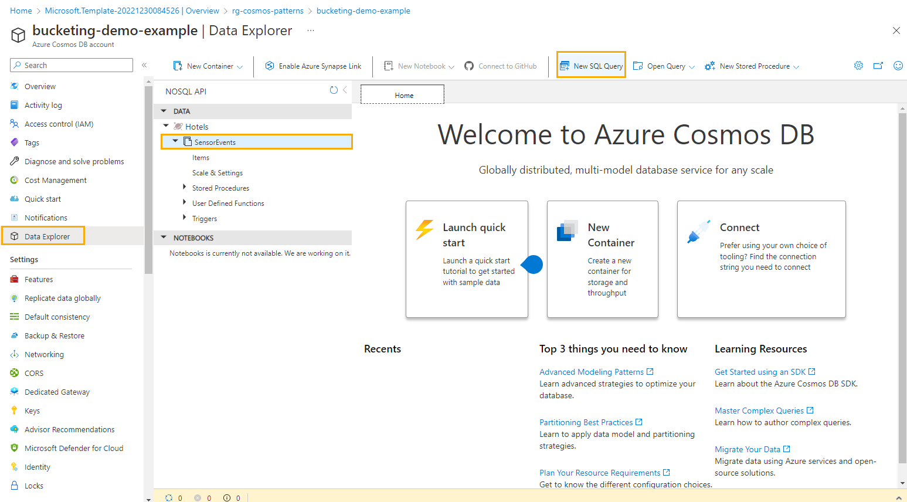

# Azure Cosmos DB design pattern: Data Binning

The binning pattern (sometimes called windowing pattern) is used when the data being tracked is being created at a high velocity and the use case only requires summaries or snapshots of a window of data. A common example is if one thousand sensors are configured to each track one reading per 5 seconds. There may be an alerting system that benefits from that frequency, but the applications using Azure Cosmos DB only want to see the data summarized by minute. As data is generated, it is summarized over a window of 1 minute and only the summarized records are stored in the Azure Cosmos DB collection.

> This sample demonstrates:
>
> - ✅ Design and implementation of data binning to optimize cost.
> - ✅ Simulation of sensor events and then binning them into 1 minute windows before storing them in Azure Cosmos DB.
> - ✅ Triggering a function with default values of 10 devices for 3 minutes.
>

## Common scenario

A common scenario for data binning with NoSQL data is when you need to aggregate and summarize large volumes of data based on specific criteria or ranges. Binning, also known as bucketing or histogramming, is a technique used to group data points into bins or categories based on their values.

Let's say you have a social media platform where users generate a significant amount of data, such as posts, comments, and likes. You want to analyze the engagement levels of users based on the number of likes received by their posts. Instead of analyzing each individual like event, you can use data binning to group the posts into different ranges of likes, such as 0-10 likes, 11-20 likes, 21-30 likes, and so on.

By applying data binning, you can efficiently calculate metrics like the average number of likes per post in each bin, identify the most popular posts within specific ranges, or track changes in user engagement over time. This aggregation and summarization of data into bins enable you to derive meaningful insights and make informed decisions.

If this pattern is not used for this scenario, it would result in a high volume of rows in an Azure Cosmos DB collection. Storing that detail would keep flexibility for all types of queries, but the performance and cost would not be optimal for querying at the 1 minute level. By applying calculations over an appropriate time window, less storage is required, less work is performed by each read, and less processing power is required to support queries.

## Sample implementation

In this section we will walk through a case study on how to design and implement binning to optimize cost.

An example where binning is preferred is when working with sensor data from Internet of Things (IoT) devices. For example, a hotel chain has devices installed in all rooms to read the temperature and send events to a centralized service. Each of those devices is configured to send an event to Azure IoT Hub every 5 seconds. For a hotel chain with one thousand rooms across its locations, that results in 12,000 records per minute. The online monitoring application which uses Azure Cosmos DB only needs to show results once per minute. By applying the binning pattern with a window of 1 minute, the Azure Cosmos DB container will write 1,000 records per minute. This reduces the RSUs required for both write and read operations without losing any detail the application requires.

The demo code will simulate events and bucket them within the same Azure function app. It accepts parameters for how many devices to simulate data for and for what period of time. The events generated will be every 5 seconds but the app collects and aggregates these to the minute before saving to Azure Cosmos DB. The focus is on seeing how incoming sensore events will be modeled differently to fit into 1 minute buckets in a Azure Cosmos DB container.

A sample of incoming events sent every second would look like this (but this is not written to Azure Cosmos DB):

```json
{
  "deviceId": 1,
  "eventTimestamp": "12/30/2022 10:53:05 PM",
  "temperature": 71.3,
  "unit": "Fahrenheit",
  "receivedTimestamp": "12/30/2022 10:53:05.128 PM"
},
{
  "deviceId": 1,
  "eventTimestamp": "12/30/2022 10:53:10 PM",
  "temperature": 71.2,
  "unit": "Fahrenheit",
  "receivedTimestamp": "12/30/2022 10:53:10.101 PM"
},
{
  "deviceId": 1,
  "eventTimestamp": "12/30/2022 10:53:15 PM",
  "temperature": 71.1,
  "unit": "Fahrenheit",
  "receivedTimestamp": "12/30/2022 10:53:15.121 PM"
}
```

Once binning is applied to summarize to a 1 minute window, the resulting event would look like this and be writtend to Azure Cosmos DB:
```json
{
  "deviceId": 1,
  "eventTimestamp": "12/30/2022 10:53:00 PM",
  "avgTemperature": 71.2,
  "minTemperature": 71.1,
  "maxTemperature": 71.3,
  "numberOfReadings": 12,
  "readings": [
        {
            "eventTimestamp": "12/30/2022 10:53:05 PM",
            "temperature": 71.1
        },
        {
            "eventTimestamp": "12/30/2022 10:53:10 PM",
            "temperature": 71.1
        },
        {
            "eventTimestamp": "12/30/2022 10:53:15 PM",
            "temperature": 71.2
        },
        {
            "eventTimestamp": "12/30/2022 10:53:20 PM",
            "temperature": 71.2
        },
        {
            "eventTimestamp": "12/30/2022 10:53:25 PM",
            "temperature": 71.2
        },
        {
            "eventTimestamp": "12/30/2022 10:53:30 PM",
            "temperature": 71.2
        },
        {
            "eventTimestamp": "12/30/2022 10:53:35 PM",
            "temperature": 71.2
        },
        {
            "eventTimestamp": "12/30/2022 10:53:40 PM",
            "temperature": 71.2
        },
        {
            "eventTimestamp": "12/30/2022 10:53:45 PM",
            "temperature": 71.2
        },
        {
            "eventTimestamp": "12/30/2022 10:53:50 PM",
            "temperature": 71.2
        },
        {
            "eventTimestamp": "12/30/2022 10:53:55 PM",
            "temperature": 71.3
        },
        {
            "eventTimestamp": "12/30/2022 10:54:00 PM",
            "temperature": 71.3
        }],
  "receivedTimestamp": "12/30/2022 10:54:00 PM"
}

```

Note: In the demo application, aggregated events are collected based on system time. The `numberOfReadings` will likely be less than 12 on the earliest `eventTimestamp` because that is usually a partial minute (from whenever the application is started until the first time current timestamp has seconds value of `00`).

## Try this implementation

In order to run the demos, you will need:

- [.NET 6.0 Runtime](https://dotnet.microsoft.com/download/dotnet/6.0)
- [Azure Functions Core Tools v4](https://learn.microsoft.com/azure/azure-functions/functions-run-local#install-the-azure-functions-core-tools)

## Confirm required tools are installed

Confirm you have the required versions of the tools installed for this demo.

First, check the .NET runtime with this command:

```bash
dotnet --list-runtimes
```

As you may have multiple versions of the runtime installed, make sure that .NET components with versions that start with 6.0 appear as part of the output.

Next, check the version of Azure Functions Core Tools with this command:

```bash
func --version
```

You should have installed a version that starts with `4.`. If you do not have a v4 version installed, you will need to uninstall the older version and follow [these instructions for installing Azure Functions Core Tools](https://learn.microsoft.com/azure/azure-functions/functions-run-local#install-the-azure-functions-core-tools).

## Getting the code

There are a few ways you can start working with the code in this demo.

### **Clone the Repository to Your Local Computer:**

**Using the Terminal:**

- Open the terminal on your computer.
- Navigate to the directory where you want to clone the repository.
- Type `git clone https://github.com/AzureCosmosDB/design-patterns.git` and press enter.
- The repository will be cloned to your local machine.

**Using Visual Studio Code:**

- Open Visual Studio Code.
- Click on the **Source Control** icon in the left sidebar.
- Click on the **Clone Repository** button at the top of the Source Control panel.
- Paste `https://github.com/AzureCosmosDB/design-patterns.git` into the text field and press enter.
- Select a directory where you want to clone the repository.
- The repository will be cloned to your local machine.

### **Fork the Repository:**

Forking the repository allows you to create your own copy of the repository under your GitHub account. This copy is independent of the original repository and is stored on your account. You can make changes to your forked copy without affecting the original repository. To fork the repository:

- Visit the repository URL: [https://github.com/AzureCosmosDB/design-patterns](https://github.com/AzureCosmosDB/design-patterns)
- Click the "Fork" button at the top right corner of the repository page.
- Select where you want to fork the repository (your personal account or an organization).
- After forking, you'll have your own copy of the repository under your account. You can make changes, create branches, and push your changes back to your fork.
- After forking the repository, open the repository on GitHub: [https://github.com/YourUsername/design-patterns](https://github.com/YourUsername/design-patterns) (replace `YourUsername` with your GitHub username).
- Click the "Code" button and copy the URL (HTTPS or SSH) of the repository.
- Open a terminal on your local computer and navigate to the directory where you want to clone the repository using the `cd` command.
- Run the command: `git clone <repository_url>` (replace `<repository_url>` with the copied URL).
- This will create a local copy of the repository on your computer, which you can modify and work with.

### **GitHub Codespaces**

You can try out this implementation by running the code in [GitHub Codespaces](https://docs.github.com/codespaces/overview) with a [free Azure Cosmos DB account](https://learn.microsoft.com/azure/cosmos-db/try-free). (*This option doesn't require an Azure subscription, just a GitHub account.*)

- Open the application code in a GitHub Codespace:

    [](https://codespaces.new/azure-samples/cosmos-db-design-patterns?quickstart=1&devcontainer_path=.devcontainer%2Fdata-binning%2Fdevcontainer.json)

## Create an Azure Cosmos DB for NoSQL account

1. Create a free Azure Cosmos DB for NoSQL account: (<https://cosmos.azure.com/try>)

1. In the Data Explorer, create a new database and container with the following values:

    | | Value |
    | --- | --- |
    | **Database name** | `Hotels` |
    | **Container name** | `SensorEvents` |
    | **Partition key path** | `/DeviceId` |
    | **Throughput** | `400` (*Manual*) |

## Set up environment variables

1. Go to resource group
1. Select the new Azure Cosmos DB for NoSQL account.
1. From the navigation, under **Settings**, select **Keys**. The values you need for the environment variables for the demo are here.

1. Create 2 environment variables to run the demos:

    - `COSMOS_ENDPOINT`: set to the `URI` value on the Azure Cosmos DB account Keys blade.
    - `COSMOS_KEY`: set to the Read-Write `PRIMARY KEY` for the Azure Cosmos DB for NoSQL account

1. Open a terminal in your GitHub Codespace and create your Bash variables with the following syntax:

    ```bash
    export COSMOS_ENDPOINT="YOUR_COSMOS_ENDPOINT"
    export COSMOS_KEY="YOUR_COSMOS_KEY"
    ```

## Run the demo

1. Open the application code.  Add a file to the folder `Cosmos_Patterns_Bucketing` called **local.settings.json** with the following contents:

    ```json
    {
        "IsEncrypted": false,
        "Values": {
            "AzureWebJobsStorage": "UseDevelopmentStorage=true",
            "FUNCTIONS_WORKER_RUNTIME": "dotnet"
        }
    }
    ```

1. Start the function app to wait for HTTP calls to simulate events and binning.

```bash
func start
```

To trigger the function to generate events and write bucketed entries to Cosmos DB, you can review and run Program.cs.

Open a new terminal and run the included Console App (Program.cs) which generates events saves them bucketed by device and minute:
```bash
dotnet run
```

While the Console App is running you may return to the terminal window where the function was started to see that it is writing batches to Cosmos DB.

## Querying the binned sensor data
Once you have run the demo which generates data, you can run queries directly against the event source container by using **Data Explorer** in the Azure Portal.

1. In Azure Portal, browse to you Cosmos DB resource.
1. Select **Data Explorer** in the left menu.
1. Select your container, then choose **New SQL Query**. 


Below is an example query for checking how many minutes the maxTemperature or minTemperature has been out of the expected range for each device.

```sql
SELECT
  c.DeviceId,
  COUNT(1) as MinutesWithAnomaly
FROM SensorEvents c
WHERE (c.minTemperature < 68 OR c.maxTeperature > 80) 
GROUP BY c.DeviceId
```

An example to check each reading in the array and count how many events were out of the expected range, you can use the `IN` keyword to access each array element in the query:
```sql
SELECT
  c.DeviceId,
  Count(1) as ReadingAnomalies
FROM SensorEvents c 
  JOIN t IN c.readings
  WHERE t.temperature < 68 OR t.temperature > 80
GROUP BY c.DeviceId
```

Note: The generated data will likely have many values considered anomalies. You can test out different filters to create your own rules.

## Summary

When modeling binned data, it is important to consider which summarized values may be helpful. If maximum and minimum are not useful, then those can be left out. Most often a sum, count, average, or all three will be helpful.
