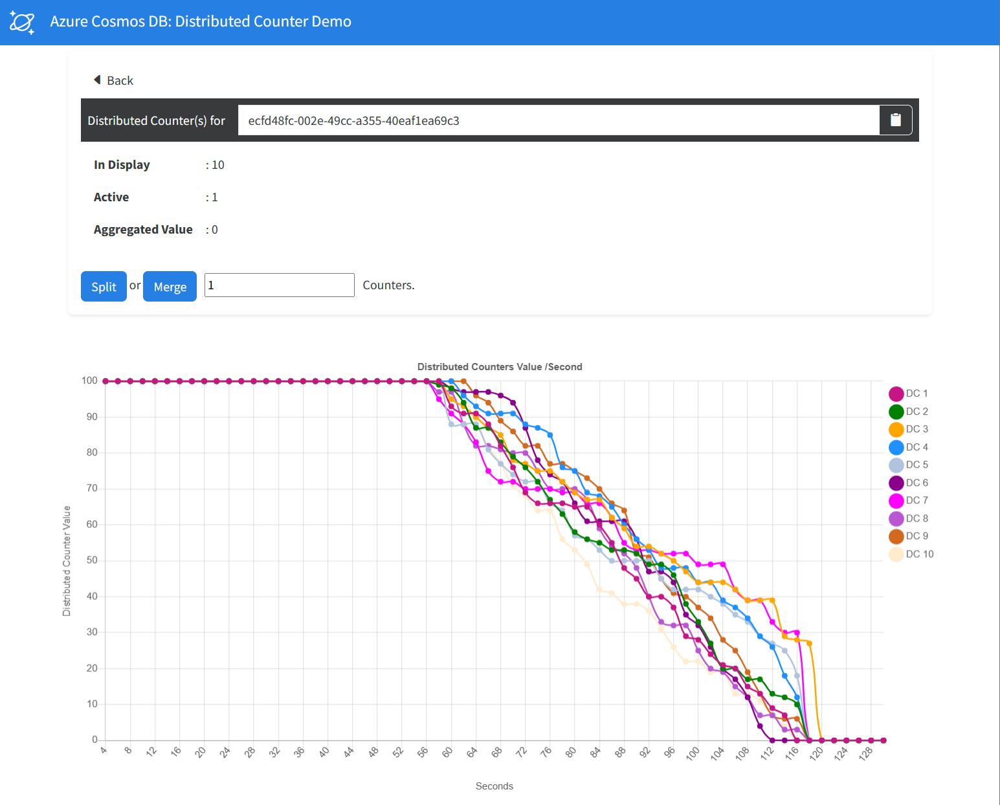
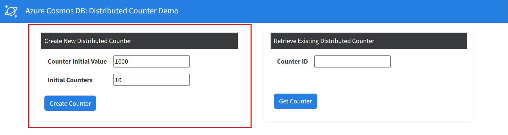
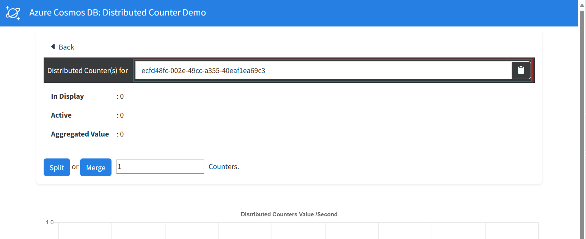
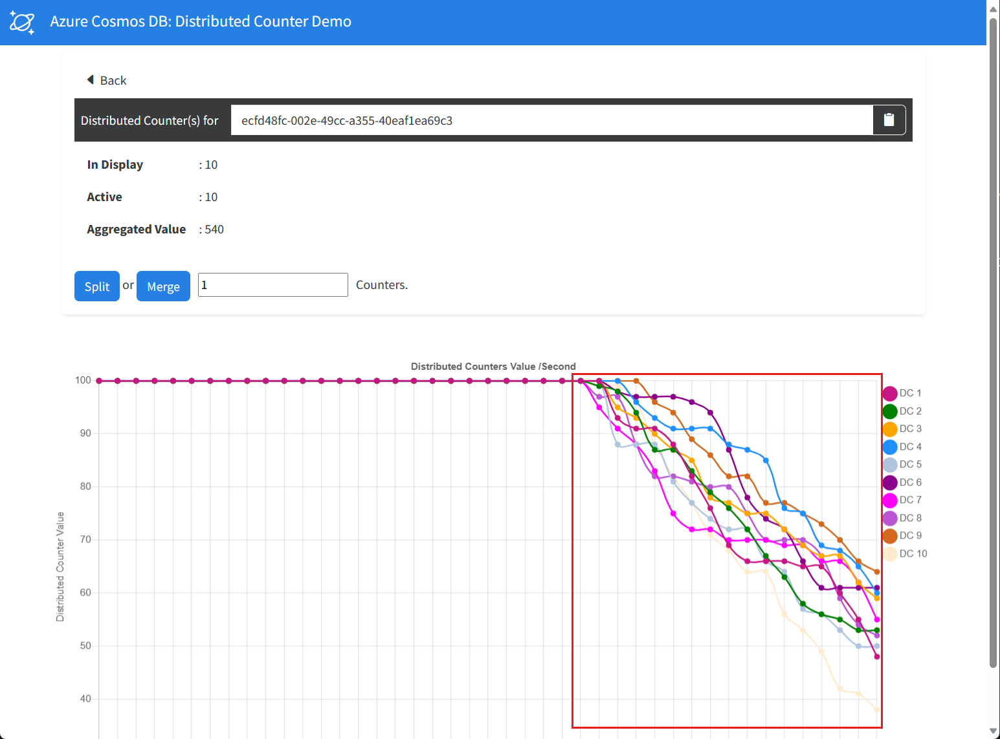

# Azure Cosmos DB design pattern: Distributed counter

In a high concurrency application, many client applications may need to update a counter property within a single item in real-time. Typically, this update operation would cause a concurrency issues or contention. The distributed counter pattern solves this problem by managing the increment/decrement of a counter separately from the impacted item.

This sample demonstrates:

- ✅ Creation of multiple distributed counters using the value of a primary counter.
- ✅ On-demand splitting and merging of distributed counters.
- ✅ Calculation of an aggregated value from the distributed counters at any given time.
- ✅ Modifying the distributed counters randomly using a large number of worker threads.

## Common scenario

Consider a high-traffic website that tracks the inventory of a product in real-time for customers and internal services. In this high concurrency environment, updating a single document continuously causes significant contention.

Typically, you can avoid concurrency issues by implementing optimistic concurrency control, but this strategy may cause scenarios where the latest inventory isn't accurate in real-time. It's important for all aspects of the application to be able to update the count quickly and read a highly accurate count value in real-time.

## Solution

In a distributed counter solution, a group of distributed counter items are used to keep track of the number. By having the solution distribute the counter across multiple items, update operations can be performed on a random item without causing contention. Even more, the solution can calculate the total of all counters at any time using an aggregation of the values from each individual counter.

## Sample implementation

This sample is implemented as a C#/.NET application with three projects. The three projects are described here:

- **Counter** class library:

  - This class library implements the distributed counter pattern using two services.

  - The `DistributedCounterManagementService` creates the counter and manages on-demand splitting or merging.

  - The `DistributedCounterOperationalService` updates the counters in a high traffic workload. This service picks a random distributed counter from the pool of available counters and updates the counter using a partial document update (or HTTP PATCH request). This service's implementation ensures that there are no conflicts to updating the counter and each counter update is an atomic transaction.

- **Visualizer** web application:

  - This Blazor web application renders a visual interface for the distributed counters.

  - The web application uses graphical charts to illustrate how the counters are performing in real-time.
  
  - The web application polls the `DistributedCounterManagementService` for the data rendered in the chart.

  

- **Consumers** console application:

  - This console application mimics a high traffic workload.

  - The console application creates multiple concurrent threads. Each thread runs in a loop to update the distributed counters quickly.

  - The console application uses the `DistributedCounterOperationalService` to update the counters.

  ```output
  ── Starting distributed counter consumer... ───────────────────────────────
  What is the counter ID? ecfd48fc-002e-49cc-a355-40eaf1ea69c3
  What are the number of worker threads required? 3
  ── 3 worker threads are running... ────────────────────────────────────────
  Success         Decrement by 2
  ...
  ```

## Try this implementation

To run the function app for Event Sourcing Pattern, you will need to have:

- [.NET 6.0 Runtime](https://dotnet.microsoft.com/download/dotnet/6.0)
- [Azure Functions Core Tools](https://learn.microsoft.com/azure/azure-functions/functions-run-local#install-the-azure-functions-core-tools)

## Confirm required tools are installed

Confirm you have the required versions of the tools installed for this demo.

First, check the .NET runtime with this command:

```bash
dotnet --list-runtimes
```

As you may have multiple versions of the runtime installed, make sure that .NET components with versions that start with 6.0 appear as part of the output.

Next, check the version of Azure Functions Core Tools with this command:

```bash
func --version
```

You should have a version 4._x_ installed. If you do not have this version installed, you will need to uninstall the older version and follow [these instructions for installing Azure Functions Core Tools](https://learn.microsoft.com/azure/azure-functions/functions-run-local#install-the-azure-functions-core-tools).

## Getting the code

There are a few ways you can start working with the code in this demo.

### **Clone the Repository to Your Local Computer:**

**Using the Terminal:**

- Open the terminal on your computer.
- Navigate to the directory where you want to clone the repository.
- Type `git clone https://github.com/AzureCosmosDB/design-patterns.git` and press enter.
- The repository will be cloned to your local machine.

**Using Visual Studio Code:**

- Open Visual Studio Code.
- Click on the **Source Control** icon in the left sidebar.
- Click on the **Clone Repository** button at the top of the Source Control panel.
- Paste `https://github.com/AzureCosmosDB/design-patterns.git` into the text field and press enter.
- Select a directory where you want to clone the repository.
- The repository will be cloned to your local machine.

### **Fork the Repository:**

Forking the repository allows you to create your own copy of the repository under your GitHub account. This copy is independent of the original repository and is stored on your account. You can make changes to your forked copy without affecting the original repository. To fork the repository:

- Visit the repository URL: [https://github.com/AzureCosmosDB/design-patterns](https://github.com/AzureCosmosDB/design-patterns)
- Click the "Fork" button at the top right corner of the repository page.
- Select where you want to fork the repository (your personal account or an organization).
- After forking, you'll have your own copy of the repository under your account. You can make changes, create branches, and push your changes back to your fork.
- After forking the repository, open the repository on GitHub: [https://github.com/YourUsername/design-patterns](https://github.com/YourUsername/design-patterns) (replace `YourUsername` with your GitHub username).
- Click the "Code" button and copy the URL (HTTPS or SSH) of the repository.
- Open a terminal on your local computer and navigate to the directory where you want to clone the repository using the `cd` command.
- Run the command: `git clone <repository_url>` (replace `<repository_url>` with the copied URL).
- This will create a local copy of the repository on your computer, which you can modify and work with.

### **GitHub Codespaces**

You can try out this implementation by running the code in [GitHub Codespaces](https://docs.github.com/codespaces/overview) with a [free Azure Cosmos DB account](https://learn.microsoft.com/azure/cosmos-db/try-free). (*This option doesn't require an Azure subscription, just a GitHub account.*)

- Open the application code in a GitHub Codespace:

    [](https://codespaces.new/azure-samples/cosmos-db-design-patterns?quickstart=1&devcontainer_path=.devcontainer%2Fdistributed-counter%2Fdevcontainer.json)

## Create an Azure Cosmos DB for NoSQL account

1. Create a free Azure Cosmos DB for NoSQL account: (<https://cosmos.azure.com/try>)

1. In the Data Explorer, create a new database and container with the following values:

    | | Value |
    | --- | --- |
    | **Database name** | `CounterDB` |
    | **Container name** | `Counters` |
    | **Partition key path** | `/pk` |
    | **Throughput** | `400` (*Manual*) |

## Get Azure Cosmos DB connection information

You will need a connection string for the Azure Cosmos DB account.

1. Go to resource group

1. Select the new Azure Cosmos DB for NoSQL account.

1. From the navigation, under **Settings**, select **Keys**. The values you need for the environment variables for the demo are here.

1. While on the Keys blade, make note of the `PRIMARY CONNECTION STRING`. You will need this for the Azure Function App.

## Prepare the app configuration

1. Open the code, create an **appsettings.Development.json** file in both the **/visualizer** and **/consumerapp** folders. In each of the files, create a JSON object with **CosmosUri** and **CosmosKey** properties. Use the URI and primary key you recorded earlier for these values:

    ```json
    {
      "CosmosUri": "<endpoint>",
      "CosmosKey": "<primary-key>"
    }
    ```

1. Open a terminal and run the web application. The web application opens in a new browser window.

    ```bash
    cd Visualizer
    dotnet run
    ```

1. In the web application, create a new counter using the default settings.

    

1. Record the value of the **Counter ID** field in the web application.

    

1. Back in the codespace, open a second terminal and run the console application. The console application prompts you for the counter's unique identifier and a count of worker threads to use.

    ```bash
    cd ConsumerApp
    dotnet run
    ```

    ```output
    ── Starting distributed counter consumer... ───────────────────────────────
    What is the counter ID? ecfd48fc-002e-49cc-a355-40eaf1ea69c3
    What are the number of worker threads required? 3
    ── 3 worker threads are running... ────────────────────────────────────────
    Success         Decrement by 2
    Success         Decrement by 3
    Success         Decrement by 3
    Success         Decrement by 1
    Success         Decrement by 1
    Success         Decrement by 2
    Success         Decrement by 3
    Success         Decrement by 2
    Success         Decrement by 1
    Success         Decrement by 1
    Success         Decrement by 3
    ...
    Failed          Attemped to decrement by 2
    Failed          Attemped to decrement by 3
    Failed          Attemped to decrement by 2
    ```

1. Go back to the web application and observe the counters values change over time.

    

## Summary

In conclusion, the Distributed Counter design pattern offers a powerful solution for managing count-related data in NoSQL databases. By leveraging distributed systems' capabilities, this pattern enables the seamless tracking of numeric values across various nodes, ensuring accuracy and scalability. Through careful design and implementation, applications can efficiently handle scenarios involving likes, votes, or any form of quantifiable interactions.

The beauty of the Distributed Counter lies in its ability to maintain consistency in a distributed environment, achieving high availability and fault tolerance. By leveraging atomic operations and optimized data structures, it minimizes contention while delivering rapid and accurate count updates.

From social media interactions to monitoring system metrics, the Distributed Counter pattern empowers applications to handle dynamic, high-velocity scenarios. By incorporating this pattern, developers can harness the full potential of NoSQL databases, ensuring reliable count management that scales alongside user engagement and system growth.

As technology continues to evolve, and as user interactions become increasingly diverse and complex, the Distributed Counter design pattern remains an essential tool in a developer's toolkit, providing a solid foundation for effective count management in the dynamic world of modern distributed applications.