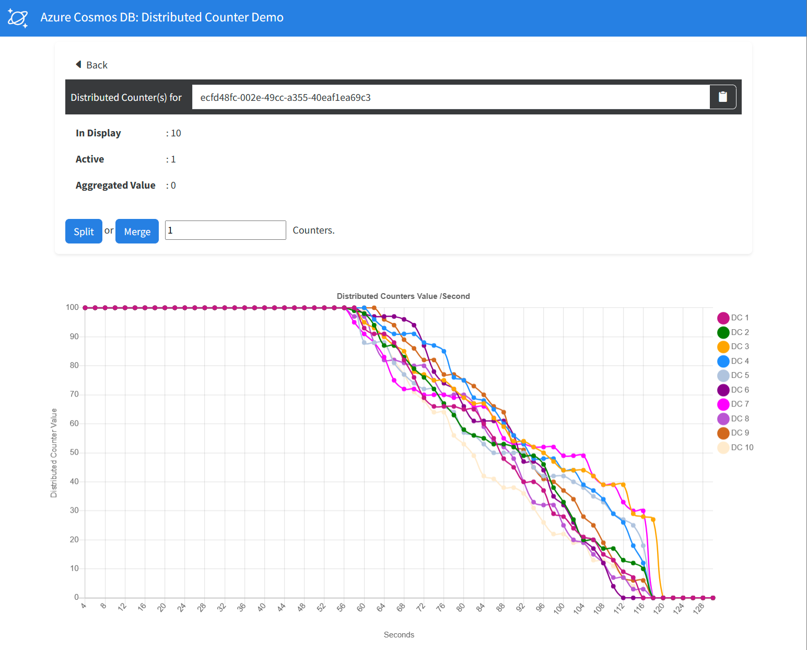
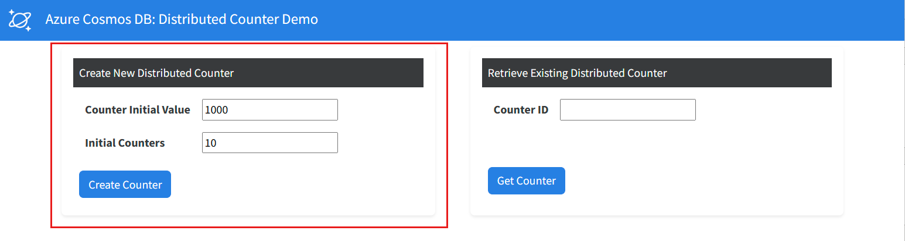
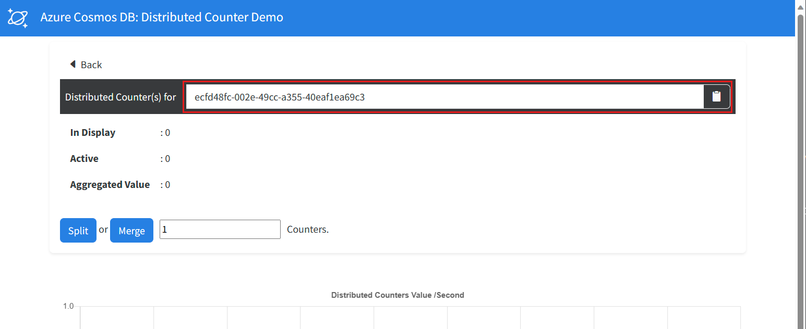
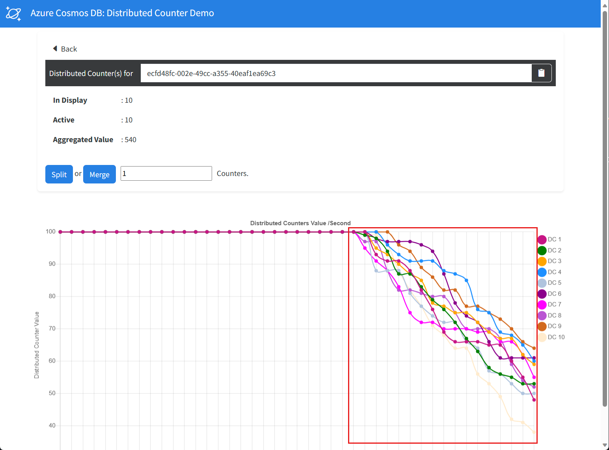

# Azure Cosmos DB design pattern: Distributed counter

In a high concurrency application, many client applications may need to update a counter property within a single item in real-time. Typically, this update operation would cause a concurrency issues or contention. The distributed counter pattern solves this problem by managing the increment/decrement of a counter separately from the impacted item.

This sample demonstrates:

- ✅ Creation of multiple distributed counters using the value of a primary counter.
- ✅ On-demand splitting and merging of distributed counters.
- ✅ Calculation of an aggregated value from the distributed counters at any given time.
- ✅ Modifying the distributed counters randomly using a large number of worker threads.

## Common scenario

Consider a high-traffic website that tracks the inventory of a product in real-time for customers and internal services. In this high concurrency environment, updating a single document continuously causes significant contention.

Typically, you can avoid concurrency issues by implementing optimistic concurrency control, but this strategy may cause scenarios where the latest inventory isn't accurate in real-time. It's important for all aspects of the application to be able to update the count quickly and read a highly accurate count value in real-time.

## Solution

In a distributed counter solution, a group of distributed counters, implemented as documents, are used to keep track of the number. By having the solution distribute the counter across multiple documents, update operations can be performed on a random document without causing contention. Calculating the current counter value can be done at any time by performing an aggregation of the values across all the documents in a query.

## Sample implementation

This sample is implemented as a C#/.NET application with three projects. The three projects are described here:

- **Counter** class library:

  - This class library implements the distributed counter pattern using two services.
  - The `DistributedCounterManagementService` creates the counter and manages on-demand splitting or merging.
  - The `DistributedCounterOperationalService` updates the counters in a high traffic workload. This service picks a random distributed counter from the pool of available counters and updates the counter using a partial document update (or HTTP PATCH request). This service's implementation ensures that there are no conflicts to updating the counter and each counter update is an atomic transaction.

- **Visualizer** web application:

  - This Blazor web application renders a visual interface for the distributed counters.
  - The web application uses graphical charts to illustrate how the counters are performing in real-time.
  - The web application polls the `DistributedCounterManagementService` for the data rendered in the chart.

  

- **Consumers** console application:

  - This console application mimics a high traffic workload.
  - The console application creates multiple concurrent threads. Each thread runs in a loop to update the distributed counters quickly.
  - The console application uses the `DistributedCounterOperationalService` to update the counters.

  ```output
  ── Starting distributed counter consumer... ───────────────────────────────
  What is the counter ID? ecfd48fc-002e-49cc-a355-40eaf1ea69c3
  What are the number of worker threads required? 3
  ── 3 worker threads are running... ────────────────────────────────────────
  Success         Decrement by 2
  ...
  ```

## Getting the code

### Using Terminal or VS Code

Directions installing pre-requisites to run locally and for cloning this repository using [Terminal or VS Code](../README.md?#getting-started)


### GitHub Codespaces

Open the application code in GitHub Codespaces:

[](https://codespaces.new/azure-samples/cosmos-db-design-patterns?quickstart=1&devcontainer_path=.devcontainer%2Fdistributed-counter%2Fdevcontainer.json)

## Set up application configuration files

You need to configure **two** application configuration files to run this app.

1. Go to your resource group and select the Serverless Azure Cosmos DB for NoSQL account that you created for this repository.

1. From the navigation, under **Settings**, select **Keys** and copy the **URI** value.

### Option 1: Keyless authentication via RBAC (Recommended)

Keyless authentication using `DefaultAzureCredential` is the recommended approach. It works automatically with managed identity (Azure-hosted) and with the Azure CLI locally.

1. Assign the **Cosmos DB Built-in Data Contributor** role to your identity:

    ```bash
    az cosmosdb sql role assignment create \
      --account-name <cosmos-account-name> \
      --resource-group <resource-group-name> \
      --role-definition-name "Cosmos DB Built-in Data Contributor" \
      --principal-id $(az ad signed-in-user show --query id -o tsv) \
      --scope "/"
    ```

1. Sign in with the Azure CLI (for local development):

    ```bash
    az login
    ```

1. Open the **Visualizer** project and set these values as environment variables (recommended — see [Configuration and authentication](../README.md#configuration-and-authentication)), or add an **appsettings.development.json** file with the following contents:

    ```json
    {
      "CosmosUri": "<endpoint>",
      "CosmosDatabase": "CounterDB",
      "CosmosContainer": "Counters"
    }
    ```

1. Replace `<endpoint>` with the **URI** value copied from the Keys blade.

Next move to the other project.

1. Open the **ConsumerApp** project and set the same values as environment variables, or add an **appsettings.development.json** file with the same contents.

### Option 2: Key-based authentication (local emulator fallback)

If you are using the Azure Cosmos DB Emulator or cannot use RBAC, set `CosmosKey` as well:

1. From the Keys blade, copy both the **URI** and **PRIMARY KEY** values.

1. Open the **Visualizer** project and set these values as environment variables (recommended — see [Configuration and authentication](../README.md#configuration-and-authentication)), or add an **appsettings.development.json** file with the following contents:

    ```json
    {
      "CosmosUri": "<endpoint>",
      "CosmosKey": "<primary-key>",
      "CosmosDatabase": "CounterDB",
      "CosmosContainer": "Counters"
    }
    ```

1. Open the **ConsumerApp** project and set the same values as environment variables, or add an **appsettings.development.json** file with the same contents.

> **Note:** Never commit `appsettings.development.json` with real key values. The `.gitignore` already excludes `appsettings.development.json`.

1. Modify the **Copy to Output Directory** to **Copy Always** (For VS Code add the XML below to the csproj file)
1. Save the file.

  ```xml
    <ItemGroup>
      <Content Update="appsettings.development.json">
        <CopyToOutputDirectory>Always</CopyToOutputDirectory>
      </Content>
    </ItemGroup>
  ```

## Run the demo locally

> This sample can be run **two ways**: *all-local* (this section — the Visualizer and ConsumerApp on your machine or in Codespaces, against the emulator or your own account) or *all-Azure* (the Visualizer hosted in Azure with the ConsumerApp run locally — see [Deploy and run in Azure](#optional-deploy-and-run-in-azure-with-azd) below). You don't need Azure to learn the pattern.

1. Open a terminal and run the web application. The web application opens in a new browser window.

    ```bash
    cd Visualizer
    dotnet run
    ```

1. If a new browser window does not open, navigate to: `http://localhost:5000`

1. In the web application, create a new counter using the default settings.

    

1. Click the clip board icon on the right to the value of the **Counter ID** field in the web application.

    

1. Back in the codespace, open a second terminal and run the console application. The console application prompts you for the counter's unique identifier and a count of worker threads to use.

    ```bash
    cd ConsumerApp
    dotnet run
    ```

    ```output
    ── Starting distributed counter consumer... ───────────────────────────────
    What is the counter ID? ecfd48fc-002e-49cc-a355-40eaf1ea69c3
    What are the number of worker threads required? 3
    ── 3 worker threads are running... ────────────────────────────────────────
    Success         Decrement by 2
    Success         Decrement by 3
    Success         Decrement by 3
    Success         Decrement by 1
    Success         Decrement by 1
    Success         Decrement by 2
    Success         Decrement by 3
    Success         Decrement by 2
    Success         Decrement by 1
    Success         Decrement by 1
    Success         Decrement by 3
    ...
    Failed          Attemped to decrement by 2
    Failed          Attemped to decrement by 3
    Failed          Attemped to decrement by 2
    ```

1. Go back to the web application and observe the counters values change over time.

    

1. When all the counters drop to zero in the chart, return to the consumer app and press `ctrl-c` to stop the app.

## (Optional) Deploy and run in Azure with `azd`

The steps above run everything **all-local**. If you'd rather run the **all-Azure** way — the Visualizer dashboard hosted in Azure over a keyless Cosmos DB account — this pattern includes an [Azure Developer CLI (`azd`)](https://aka.ms/azd) template. Running locally is unchanged; the deployment files (`azure.yaml`, `infra/`) have no effect unless you run `azd up`.

It provisions and deploys, intentionally minimal and cheap:

- An **App Service** web app (Basic **B1**) hosting the **Visualizer** dashboard.
- A **serverless** Azure Cosmos DB account with local (key) authentication **disabled**, with the `CounterDB` database and `Counters` container pre-created.
- The Visualizer reaches Cosmos DB **keyless**, via a **user-assigned managed identity** — no keys or connection strings are stored anywhere. The deploying user is also granted data access so you can run the **ConsumerApp** locally against the same account.

The **ConsumerApp** is a console driver, so it is not hosted in Azure — you run it locally against the provisioned account, exactly as in the local walkthrough above.

### Deploy

From the `distributed-counter` folder:

```bash
azd up
```

`azd` prompts for an environment name, subscription, and location, then provisions the resources and deploys the Visualizer. When it finishes it prints the site URL.

1. Open the Visualizer URL and create a new counter, then copy its **Counter ID**.
1. Run the ConsumerApp locally against the same account — keyless, using your `az login` credentials:

    ```bash
    # bash / zsh
    export CosmosUri="$(azd env get-value AZURE_COSMOS_ENDPOINT)"
    cd source/ConsumerApp && dotnet run
    ```

    ```powershell
    # PowerShell
    $env:CosmosUri = azd env get-value AZURE_COSMOS_ENDPOINT
    cd source/ConsumerApp; dotnet run
    ```

    Leave `CosmosKey` empty — with only `CosmosUri` set, the app authenticates keyless via `DefaultAzureCredential`.
1. Watch the counter values change in the Visualizer.

### Clean up

```bash
azd down
```

## Summary

In conclusion, the Distributed Counter design pattern offers a powerful solution for managing count-related data in NoSQL databases. By leveraging multiple documents and randomizing access to reduce concurrency issues, this pattern enables the tracking of numeric values at any scale with accuracy. Through careful design and implementation, applications can efficiently handle scenarios involving likes, votes, product inventory or any form of quantifiable interactions where concurrency is an issue.

The beauty of the Distributed Counter lies in its ability to maintain consistency, achieving high availability and fault tolerance. By leveraging atomic operations and optimized data structures, it minimizes contention while delivering rapid and accurate count updates.

From social media interactions, ecommerce or monitoring high-volume system metrics, the Distributed Counter pattern empowers applications to handle dynamic, high-velocity scenarios. By incorporating this pattern, developers can harness the full potential of NoSQL databases, ensuring reliable count management that scales alongside user engagement and system growth.

As technology continues to evolve, and as user interactions become increasingly diverse and complex, the Distributed Counter design pattern remains an essential tool in a developer's toolkit, providing a solid foundation for effective count management in the dynamic world of modern distributed applications.
