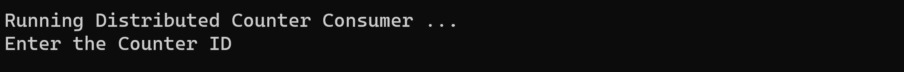

# Setup

This template will create an Azure Cosmos DB for NoSQL account with a database named `CounterDB` with a container named `Counters`.

The suggested account name includes 'YOUR_SUFFIX'. Change that to a suffix to make your account name unique.

The Azure Cosmos DB for NoSQL account will automatically be created with the region of the selected resource group.

---

**This link will work if this is a public repo.**

**For the private repo**

1. [Create a custom template deployment](https://portal.azure.com/#create/Microsoft.Template/).
2. Select **Build your own template in the editor**.
3. Copy the contents from [this template](azuredeploy.json) into the editor.
4. Select **Save**.

---

Once the template is loaded, populate the values:

- **Subscription** - Choose a subscription.
- **Resource group** - Choose a resource group.
- **Region** - Select a region for the instance.
- **Location** - Enter a location for the Azure Cosmos DB for NoSQL account. **Note**: By default, it is set to use the location of the resource group. If you need to change this value, you can find the supported regions for your subscription via:
  - [Azure CLI](https://learn.microsoft.com/cli/azure/account?view=azure-cli-latest#az-account-list-locations)
  - PowerShell: `Get-AzLocation | Where-Object {$_.Providers -contains "Microsoft.DocumentDB"} | Select location`
- **Account Name** - Replace `YOUR_SUFFIX` with a suffix to make your Azure Cosmos DB account name unique.
- **Database Name** - Set to the default **CounterDB**.
- **Container Name** - Set to  default **Counters**, is partitioned by `/pk`.
- **Throughput** - Set to the default **400**.
- **Enable Free Tier** - This defaults to `false`. Set it to **true** if you want to use it as [the free tier account](https://learn.microsoft.com/azure/cosmos-db/free-tier).

Once those settings are set, select **Review + create**, then **Create**.

## Updating Azure Cosmos DB URI and Key in Code

1. Once the template deployment is complete, select **Go to resource group**.
2. Select the new Azure Cosmos DB for NoSQL account.
3. From the navigation, under **Settings**, select **Keys**.

Update the  following in the **ConsumerApp/appsettings.json** and **Visualizer/appsettings.json** before you run the code:

- `CosmosUri`: Set to the `URI` value on the Azure Cosmos DB account Keys blade.
- `CosmosKey`: Set to the Read-Write `PRIMARY KEY` for the Azure Cosmos DB for NoSQL account

## Run the demo

1. In Visual Studio load the **DistributeCounter.sln**
1. Press **F5** . It will to run 2 projects simultaneously.
    1. Visualizer web app
    1. ConsumerApp console application
1. In the **Visualizer** web app
    1. Select 'Create Counter' to create the distributed counters.
    
    1. Copy the Distributed Counter Id  when the counters are ready.
    
1. In the **ConsumerApp** console application, paste the value of Distributed Counter Id copied in previous step. Provide the number of  worker threads you want for update the counters.

1. Switch back to the **Visualizer** web app, you should see your counters values change as they get updated by the worker threads of **ConsumerApp** .

