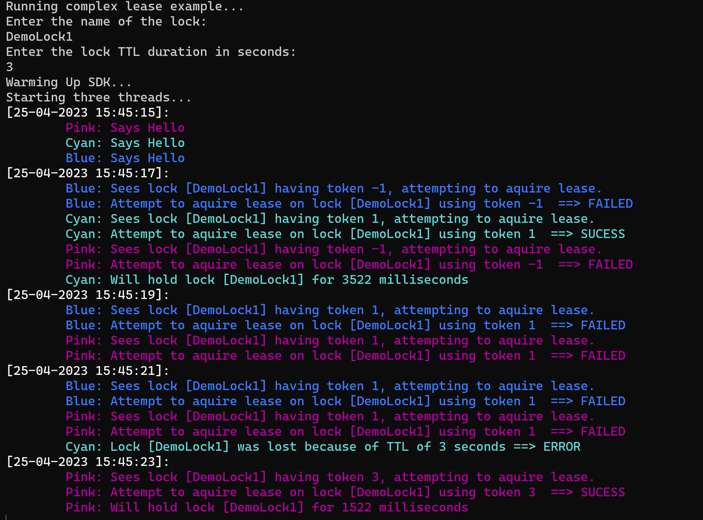

# Azure Cosmos DB design pattern: Global Distributed Lock Pattern

Locks are a way of synchronizing access to a shared resource in a distributed system. By allowing a process to acquire a token that indicates ownership of the resource. Other processes must wait until the token is released before they can acquire it. This ensures that only one process can access the resource at a time. Fence tokens are useful in scenarios where multiple processes need to access a shared resource but cannot do so concurrently.

Distributed locks are superior to regular locks in distributed systems because they enable synchronization of access to shared resources across multiple processes and machines. Regular locks can only provide synchronization within a single process or machine, which limits their applicability in distributed systems. Distributed locks are designed to handle the challenges of distributed systems, such as network delays, failures, and partitions. They also provide higher availability and fault tolerance, allowing the system to continue functioning even if some of the nodes fail. Additionally, distributed locks can be more scalable than regular locks, as they can be designed to work across a large number of nodes.

This sample demonstrates:

- ✅Optimistic concurrency control (ETag updates)
- ✅TTL (ability to set an expiration date on a document)

## Common scenario

A common scenario for using a distributed global lock in the NoSQL design pattern is when you need to enforce mutual exclusion or coordination across multiple nodes or processes in a distributed system. Here are a few examples:

1. Critical Sections: In a distributed system, there may be certain critical sections of code or operations that need to be executed atomically by a single node at a time. A distributed global lock can be used to ensure that only one node or process can enter the critical section at any given time, preventing conflicts and ensuring data consistency.

1. Resource Synchronization: When multiple nodes or processes need to access and modify a shared resource simultaneously, a distributed lock can be used to coordinate their access. For example, if multiple nodes are updating the same document in a document-oriented NoSQL database, a distributed lock can ensure that only one node can modify the document at a time, avoiding conflicts and maintaining data integrity.

1. Concurrency Control: Distributed locks can be used for concurrency control in scenarios where multiple nodes or processes are performing parallel operations on shared data. By acquiring a lock on a specific resource or data entity, a node can ensure exclusive access to that resource, preventing concurrent modifications that might lead to inconsistent or incorrect results.

1. Distributed Transactions: In a distributed transactional system, where multiple operations across different nodes need to be performed atomically, distributed locks play a crucial role. They help coordinate the different phases of a distributed transaction, ensuring that conflicting operations do not occur during the transaction's execution.

By using a distributed global lock, you can coordinate and synchronize the actions of multiple nodes or processes, providing consistency and preventing conflicts in a distributed environment. However, it's important to note that implementing distributed locks correctly and efficiently can be complex, and the specific mechanisms and techniques used may vary depending on the NoSQL database being used.

## Sample implementation

The application creates a Lock based on the Name and Time to Live( TTL) provided by the user. The Lock is created in Azure Cosmos DB and  then can be tracked by multiple geographically distributed worker threads. In this sample  the application creates 3  threads  that continuously try to get  the lock.  The worker thread holds the locks for a random number of milliseconds and then releases it. If the lock is not released with the TTL value, the lock gets released automatically.


The TTL feature is used to automatically get rid of a lease object rather than having clients do the work of checking a leasedUntil date.  This takes away one step, but you are still required to check to see if two clients tried to get a lease on the same object at the same time.  This is easily done in Azure Cosmos DB via the 'etag' property on the object.

## Try this implementation

In order to run the demos, you will need:

- [.NET 8.0 Runtime](https://dotnet.microsoft.com/download)

## Confirm required tools are installed

Confirm you have the required versions of the tools installed for this demo.

First, check the .NET runtime with this command:

```bash
dotnet --list-runtimes
```

As you may have multiple versions of the runtime installed, make sure that .NET components with versions that start with 6.0 appear as part of the output.

## Getting the code

### **Clone the Repository to Your Local Computer:**

**Using the Terminal:**

- Open the terminal on your computer.
- Navigate to the directory where you want to clone the repository.
- Type `git clone https://github.com/Azure-Samples/cosmos-db-design-patterns.git` and press enter.
- The repository will be cloned to your local machine.

**Using Visual Studio Code:**

- Open Visual Studio Code.
- Click on the **Source Control** icon in the left sidebar.
- Click on the **Clone Repository** button at the top of the Source Control panel.
- Paste `https://github.com/Azure-Samples/cosmos-db-design-patterns.git` into the text field and press enter.
- Select a directory where you want to clone the repository.
- The repository will be cloned to your local machine.

### **GitHub Codespaces**

You can try out this implementation by running the code in [GitHub Codespaces](https://docs.github.com/codespaces/overview)

- Open the application code in a GitHub Codespace:

    [](https://codespaces.new/azure-samples/cosmos-db-design-patterns?quickstart=1&devcontainer_path=.devcontainer%2Fschema-versioning%2Fdevcontainer.json)

## Create an Azure Cosmos DB for NoSQL account

1. Create a free Azure Cosmos DB for NoSQL account: (<https://cosmos.azure.com/try>)

1. In the Data Explorer, create a new databased named **LockDB** with with shared autoscale throughput:

    | | Value |
    | --- | --- |
    | **Database name** | `LockDB` |
    | **Throughput** | `1000` (*Autoscale*) |

**Note:** We are using shared database throughput because it can scale down to 100 RU/s when not running. This is the most cost efficient if running in a paid subscription and not using Free Tier.

1. Create a container named **Locks** container with the following values:

    | | Value |
    | --- | --- |
    | **Database name** | `LockDB` |
    | **Container name** | `Locks` |
    | **Partition key path** | `/id` |

1. Open the Keys blade, click the Eye icon to view the `PRIMARY KEY`. Keep this and the `URI` handy. You will need these for the next step.

## Configure the application

1. Open the application code, create an **appsettings.Development.json** file in the **/source** folder. In the file, create a JSON object with **CosmosUri** and **CosmosKey** properties. Copy and paste the values for `URI` and `PRIMARY KEY` from the previous step:

```json
{
  "DetailedErrors": true,
  "Logging": {
    "LogLevel": {
      "Default": "Information",
      "Microsoft.AspNetCore": "Warning"
    }
  },
  "AllowedHosts": "*",

  "CosmosUri": "",
  "CosmosKey": "",
  "CosmosDatabase": "LockDB",
  "CosmosContainer": "Locks",
  "retryInterval": 1
}
```

1. In the codespace, open a terminal and run the application:

```bash
dotnet run
```

1. When prompted, enter the values for the lock name and the default TTL

## Summary

Azure Cosmos DB makes implementing global lock leases fairly simple by utilizing the `TTL` and 'ETag' features.
