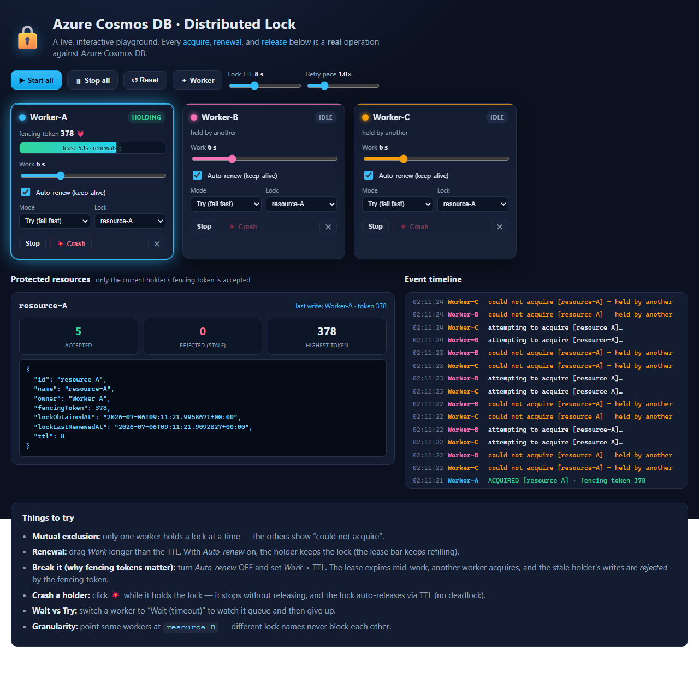

# Azure Cosmos DB design pattern: Global Distributed Lock Pattern

Locks are a way of synchronizing access to a shared resource in a distributed system. By allowing a process to acquire a token that indicates ownership of the resource. Other processes must wait until the token is released before they can acquire it. This ensures that only one process can access the resource at a time. Fence tokens are useful in scenarios where multiple processes need to access a shared resource but cannot do so concurrently.

Distributed locks are superior to regular locks in distributed systems because they enable synchronization of access to shared resources across multiple processes and machines. Regular locks can only provide synchronization within a single process or machine, which limits their applicability in distributed systems. Distributed locks are designed to handle the challenges of distributed systems, such as network delays, failures, and partitions. They also provide higher availability and fault tolerance, allowing the system to continue functioning even if some of the nodes fail. Additionally, distributed locks can be more scalable than regular locks, as they can be designed to work across a large number of nodes.

This sample demonstrates:

- ✅ A single-document lock acquired **atomically** (an insert succeeds only if the lock is free)
- ✅ Optimistic concurrency control (ETag) for safe renewal and release
- ✅ TTL so an abandoned lock is released automatically (no deadlocks)
- ✅ A monotonically increasing **fencing token** derived from the Cosmos DB session token

## Web front end

The included interactive playground runs **real** Cosmos DB locks: on-screen workers compete for a lock, the holder renews it live, and a fencing token rejects a stale writer. Try crashing the holder or turning off auto-renew to see the lease expire and another worker take over:



## Common scenario

A common scenario for using a distributed global lock in the NoSQL design pattern is when you need to enforce mutual exclusion or coordination across multiple nodes or processes in a distributed system. Here are a few examples:

1. Critical Sections: In a distributed system, there may be certain critical sections of code or operations that need to be executed atomically by a single node at a time. A distributed global lock can be used to ensure that only one node or process can enter the critical section at any given time, preventing conflicts and ensuring data consistency.

1. Resource Synchronization: When multiple nodes or processes need to access and modify a shared resource simultaneously, a distributed lock can be used to coordinate their access. For example, if multiple nodes are updating the same document in a document-oriented NoSQL database, a distributed lock can ensure that only one node can modify the document at a time, avoiding conflicts and maintaining data integrity.

1. Concurrency Control: Distributed locks can be used for concurrency control in scenarios where multiple nodes or processes are performing parallel operations on shared data. By acquiring a lock on a specific resource or data entity, a node can ensure exclusive access to that resource, preventing concurrent modifications that might lead to inconsistent or incorrect results.

1. Distributed Transactions: In a distributed transactional system, where multiple operations across different nodes need to be performed atomically, distributed locks play a crucial role. They help coordinate the different phases of a distributed transaction, ensuring that conflicting operations do not occur during the transaction's execution.

By using a distributed global lock, you can coordinate and synchronize the actions of multiple nodes or processes, providing consistency and preventing conflicts in a distributed environment. However, it's important to note that implementing distributed locks correctly and efficiently can be complex, and the specific mechanisms and techniques used may vary depending on the NoSQL database being used.

## Sample implementation

> **Credit:** the lock library in this sample (`source/CosmosDistributedLock`) is adapted — for .NET 10, and to support keyless / emulator connections — from [CloudDistributedLock](https://github.com/briandunnington/CloudDistributedLock) by Brian Dunnington, used under the MIT License.

The lock is represented by a **single document** whose `id` is the lock name. Acquiring the lock is simply an **insert**: if the document doesn't exist it is created and the lock is held; if it already exists Cosmos DB returns a **409 Conflict** and the caller knows the lock is held by someone else. This makes mutual exclusion atomic — there is no read-then-write race.

While a caller holds the lock, a background **keep-alive** loop renews the document (via `ReplaceItem` with an ETag check) shortly before its TTL elapses, so the lock stays held for as long as the work runs — even when that is longer than the TTL. When the holder finishes it deletes the document (releasing the lock); if it crashes or otherwise stops renewing, Cosmos DB's **TTL** deletes the document automatically, so the lock can never get stuck (no deadlock).

Each acquisition exposes a **fencing token** — a monotonically increasing value taken from the Azure Cosmos DB session token (its global LSN). A downstream system can use it to reject a stale lock holder.

The library exposes a small, dependency-injection-friendly API:

```csharp
var lockProvider = lockProviderFactory.GetLockProvider();

// Try once and return immediately:
using (var @lock = await lockProvider.TryAcquireLockAsync("my-resource"))
{
    if (@lock.IsAcquired)
    {
        // do critical work here; @lock.FencingToken is available
    }
}

// Or wait (optionally with a timeout) for the lock to become available:
using var waited = await lockProvider.AcquireLockAsync("my-resource", TimeSpan.FromSeconds(2));
```

This sample ships two ways to explore the pattern:

- An **interactive web front end** (`source/Website`) — a visual playground where several on-screen "workers" compete for **real** Cosmos DB locks. Adjust how long work takes, toggle the keep-alive renewal, crash a holder, and watch a **fencing token** reject a stale writer. This is the best way to *see* how the lock behaves and why it's useful.
- A **console app** (`source/ConsoleApp`) that starts three workers competing for the same lock — a quick, scriptable run showing only one holder at a time, the keep-alive holding the lock past the TTL, and a monotonically increasing fencing token.

## Getting the code

### Using Terminal or VS Code

Directions for installing pre-requisites and cloning this repository are in the [root README](../README.md#getting-started).


## Set up application configuration

Each app reads `CosmosUri` (and optionally `CosmosKey`) from configuration — see [Configuration and authentication](../README.md#configuration-and-authentication) in the root README. The **web front end defaults to the local emulator** (`https://localhost:8081`) when nothing is configured, so it runs with zero setup. For the **console app**, set `CosmosUri`/`CosmosKey` to the emulator values (see [Run locally with the emulator](../README.md#run-locally-with-the-emulator-default)) via an `appsettings.development.json` file (git-ignored) in its folder:

```json
{
  "CosmosUri": "https://localhost:8081",
  "CosmosKey": "C2y6yDjf5/R+ob0N8A7Cgv30VRDJIWEHLM+4QDU5DE2nQ9nDuVTqobD4b8mGGyPMbIZnqyMsEcaGQy67XIw/Jw=="
}
```

To use your own Azure Cosmos DB account with keyless (RBAC) authentication instead, set `CosmosUri` to your account endpoint and leave `CosmosKey` empty — the apps then use `DefaultAzureCredential`. Grant your identity the **Cosmos DB Built-in Data Contributor** role first.

## Run the demo locally

Start the local emulator first (see the [root README](../README.md#run-locally-with-the-emulator-default)), or point at your own account.

### Interactive web front end (recommended)

```bash
cd source/Website
dotnet run
```

Open the URL it prints. Several workers immediately start competing for a lock. Try dragging a worker's **Work** slider past the **Lock TTL**, toggling **Auto-renew** off, clicking **💥 Crash** on the current holder, and switching a worker to **Wait** mode — the on-screen "Things to try" list walks through the key experiments (mutual exclusion, renewal, fencing tokens, and crash/TTL recovery).

### Console app

```bash
cd source/ConsoleApp
dotnet run
```

The console app starts three workers competing for the same lock. Only one holds it at a time (the others log `could not acquire`), the holder keeps the lock even when its work runs longer than the TTL, and each acquisition prints a higher `fencing token`.

## (Optional) Deploy and run in Azure with `azd`

The steps above run the sample **all-local**. If you'd rather run the **all-Azure** way — the interactive web front end hosted in Azure over a keyless Cosmos DB account — this pattern includes an [Azure Developer CLI (`azd`)](https://aka.ms/azd) template. Running locally is unchanged; the deployment files (`azure.yaml`, `infra/`) have no effect unless you run `azd up`.

It provisions and deploys, intentionally minimal and cheap:

- An **App Service** web app (Basic **B1**) hosting the interactive front end.
- A **serverless** Azure Cosmos DB account with local (key) authentication **disabled**, with the `LockDB` database and TTL-enabled `Locks` container pre-created.
- The web app reaches Cosmos DB **keyless**, via a **user-assigned managed identity** — no keys or connection strings are stored anywhere. The deploying user is also granted data access so you can run the console app locally against the same account.

### Deploy

From the `distributed-lock` folder:

```bash
azd up
```

`azd` prompts for an environment name, subscription, and location, then provisions the resources and deploys the front end. When it finishes it prints the site URL — open it and start experimenting.

> **Consistency note:** This template provisions a single-region **serverless** account, which uses **Session** consistency. The lock's mutual exclusion comes from the atomic unique-id insert (a 409 Conflict when the lock is held) and ETag-checked renewal, so it holds under any consistency level; the fencing token is the session token's global LSN, which is monotonically increasing. For a multi-region *production* lock you would instead use provisioned throughput with **Strong** consistency; serverless accounts are single-region only.

### Clean up

```bash
azd down
```

## Summary

Azure Cosmos DB makes implementing a global lock fairly simple by utilizing the `TTL` and 'ETag' features.
