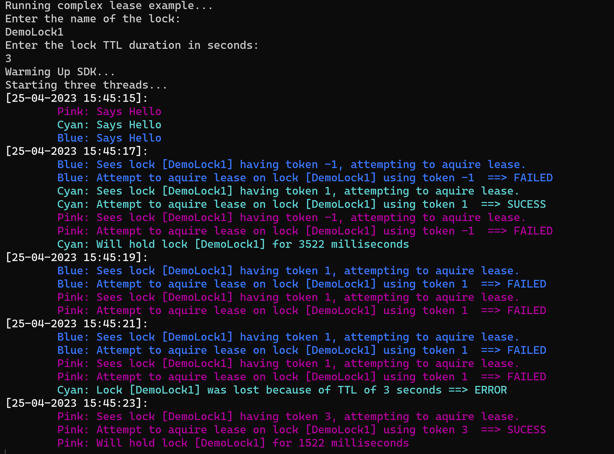

# Azure Cosmos DB design pattern: Global Distributed Lock Pattern

Locks are a way of synchronizing access to a shared resource in a distributed system. By allowing a process to acquire a token that indicates ownership of the resource. Other processes must wait until the token is released before they can acquire it. This ensures that only one process can access the resource at a time. Fence tokens are useful in scenarios where multiple processes need to access a shared resource but cannot do so concurrently.

Distributed locks are superior to regular locks in distributed systems because they enable synchronization of access to shared resources across multiple processes and machines. Regular locks can only provide synchronization within a single process or machine, which limits their applicability in distributed systems. Distributed locks are designed to handle the challenges of distributed systems, such as network delays, failures, and partitions. They also provide higher availability and fault tolerance, allowing the system to continue functioning even if some of the nodes fail. Additionally, distributed locks can be more scalable than regular locks, as they can be designed to work across a large number of nodes.

This sample demonstrates:

- ✅Optimistic concurrency control (ETag updates)
- ✅TTL (ability to set an expiration date on a document)

## Common scenario

A common scenario for using a distributed global lock in the NoSQL design pattern is when you need to enforce mutual exclusion or coordination across multiple nodes or processes in a distributed system. Here are a few examples:

1. Critical Sections: In a distributed system, there may be certain critical sections of code or operations that need to be executed atomically by a single node at a time. A distributed global lock can be used to ensure that only one node or process can enter the critical section at any given time, preventing conflicts and ensuring data consistency.

1. Resource Synchronization: When multiple nodes or processes need to access and modify a shared resource simultaneously, a distributed lock can be used to coordinate their access. For example, if multiple nodes are updating the same document in a document-oriented NoSQL database, a distributed lock can ensure that only one node can modify the document at a time, avoiding conflicts and maintaining data integrity.

1. Concurrency Control: Distributed locks can be used for concurrency control in scenarios where multiple nodes or processes are performing parallel operations on shared data. By acquiring a lock on a specific resource or data entity, a node can ensure exclusive access to that resource, preventing concurrent modifications that might lead to inconsistent or incorrect results.

1. Distributed Transactions: In a distributed transactional system, where multiple operations across different nodes need to be performed atomically, distributed locks play a crucial role. They help coordinate the different phases of a distributed transaction, ensuring that conflicting operations do not occur during the transaction's execution.

By using a distributed global lock, you can coordinate and synchronize the actions of multiple nodes or processes, providing consistency and preventing conflicts in a distributed environment. However, it's important to note that implementing distributed locks correctly and efficiently can be complex, and the specific mechanisms and techniques used may vary depending on the NoSQL database being used.

## Sample implementation

The application creates a Lock based on the Name and Time to Live (TTL) provided by the user. The Lock is created in Azure Cosmos DB and then can be tracked by multiple geographically distributed worker threads. In this sample the application creates 3 threads that continuously try to get the lock. Each worker thread that acquires the lock holds it for a random amount of time — which can be **longer than the lease TTL** — and then releases it. While a worker holds the lock and is still doing work, it automatically **renews the lease** (re-writing it before the TTL elapses) on a background timer, so no other worker can acquire the lock mid-work. If a worker stops or crashes it stops renewing, the lease expires via TTL, and the lock is released automatically — so a stalled worker can never deadlock the lock.


The TTL feature is used to automatically get rid of a lease object rather than having clients do the work of checking a leasedUntil date. This takes away one step, but you are still required to check to see if two clients tried to get a lease on the same object at the same time. This is easily done in Azure Cosmos DB via the 'etag' property on the object. The lock document itself is stored with a TTL of `-1` so it never expires (preserving its monotonically increasing fence token); only the lease object carries a TTL, and the lock holder keeps that lease alive by renewing it for as long as it holds the lock.

## Getting the code

### Using Terminal or VS Code

Directions installing pre-requisites to run locally and for cloning this repository using [Terminal or VS Code](../README.md?#getting-started)


## Set up application configuration files

You need to configure an application configuration file to run this app.

1. Go to your resource group and select the Serverless Azure Cosmos DB for NoSQL account that you created for this repository.

1. From the navigation, under **Settings**, select **Keys** and copy the **URI** value.

### Option 1: Keyless authentication via RBAC (Recommended)

Keyless authentication using `DefaultAzureCredential` is the recommended approach. It works automatically with managed identity (Azure-hosted) and with the Azure CLI locally.

1. Assign the **Cosmos DB Built-in Data Contributor** role to your identity:

    ```bash
    az cosmosdb sql role assignment create \
      --account-name <cosmos-account-name> \
      --resource-group <resource-group-name> \
      --role-definition-name "Cosmos DB Built-in Data Contributor" \
      --principal-id $(az ad signed-in-user show --query id -o tsv) \
      --scope "/"
    ```

1. Sign in with the Azure CLI (for local development):

    ```bash
    az login
    ```

1. Open the distributed-lock project and set these values as environment variables (recommended — see [Configuration and authentication](../README.md#configuration-and-authentication)), or add an **appsettings.development.json** file with the following contents:

```json
{
  "CosmosUri": "<endpoint>",
  "CosmosDatabase": "LockDB",
  "CosmosContainer": "Locks",
  "retryInterval": 1
}
```

1. Replace `<endpoint>` with the **URI** value copied from the Keys blade.

### Option 2: Key-based authentication (local emulator fallback)

If you are using the Azure Cosmos DB Emulator or cannot use RBAC, set `CosmosKey` as well:

1. From the Keys blade, copy both the **URI** and **PRIMARY KEY** values.

1. Open the distributed-lock project and set these values as environment variables (recommended — see [Configuration and authentication](../README.md#configuration-and-authentication)), or add an **appsettings.development.json** file with the following contents:

```json
{
  "CosmosUri": "<endpoint>",
  "CosmosKey": "<primary-key>",
  "CosmosDatabase": "LockDB",
  "CosmosContainer": "Locks",
  "retryInterval": 1
}
```

> **Note:** Never commit `appsettings.development.json` with real key values. The `.gitignore` already excludes `appsettings.development.json`.

1. Modify the **Copy to Output Directory** to **Copy Always** (For VS Code add the XML below to the csproj file)
1. Save the file.

  ```xml
    <ItemGroup>
      <Content Update="appsettings.development.json">
        <CopyToOutputDirectory>Always</CopyToOutputDirectory>
      </Content>
    </ItemGroup>
  ```

## Run the demo locally

1. At a command prompt or VS Code Terminal, switch to the `source` folder and run the app with:

    ```dotnetcli
    dotnet run
    ```

1. When prompted, enter the values for the lock name and the default TTL

   As the three threads compete, notice that only one holds the lock at a time. The holder keeps working even when its work runs longer than the lease TTL — you'll see `Renewed lease ... while work continues` messages and a final `Completed work while still holding lock ... ==> OK`, while the other threads report `FAILED` until the lock is released. The lease is only allowed to expire (freeing the lock) when a holder stops renewing.

## (Optional) Deploy and run in Azure with `azd`

The steps above run the sample **all-local** (against the Azure Cosmos DB emulator or your own account). If you'd rather run it against a dedicated, **keyless** Azure Cosmos DB account in Azure, this pattern includes an [Azure Developer CLI (`azd`)](https://aka.ms/azd) template. Running locally is unchanged; the deployment files (`azure.yaml`, `infra/`) have no effect unless you run `azd provision`.

Because this sample is a **console app**, there is no service hosted in Azure — `azd` only provisions the data store, intentionally minimal and cheap:

- A **serverless** Azure Cosmos DB account with local (key) authentication **disabled**.
- The sample's `LockDB` database and `Locks` container (created with a 60-second TTL so leases auto-expire, matching the app), pre-created.
- A data-plane role assignment granting **you** (the deploying user) keyless access, so you can run the console app locally against it.

### Provision

From the `distributed-lock` folder:

```bash
azd provision
```

When it finishes, point the app at the new account and run it locally — keyless, using your `az login` credentials:

```bash
# bash / zsh
export CosmosUri="$(azd env get-value AZURE_COSMOS_ENDPOINT)"
cd source && dotnet run
```

```powershell
# PowerShell
$env:CosmosUri = azd env get-value AZURE_COSMOS_ENDPOINT
cd source; dotnet run
```

Leave `CosmosKey` empty — with only `CosmosUri` set, the app authenticates keyless via `DefaultAzureCredential`.

> **Consistency note:** This template provisions a single-region **serverless** account, which uses **Session** consistency. The lock's correctness — mutual exclusion and monotonically increasing fence tokens — comes from optimistic concurrency (a unique-id insert plus `ETag`-checked patches), so it holds under any consistency level, not just Strong. For a multi-region *production* lock you would instead use provisioned throughput with **Strong** (or **Bounded staleness**) consistency; serverless accounts are single-region only.

### Clean up

```bash
azd down
```

## Summary

Azure Cosmos DB makes implementing a global lock fairly simple by utilizing the `TTL` and 'ETag' features.
