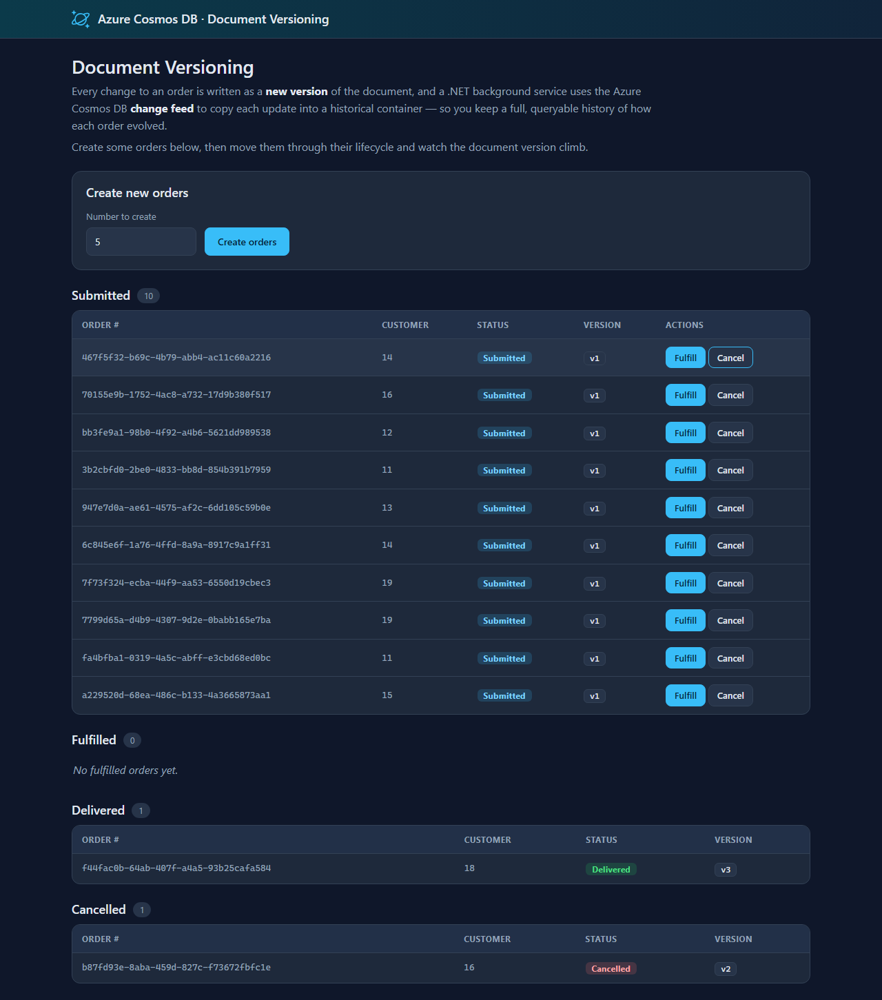
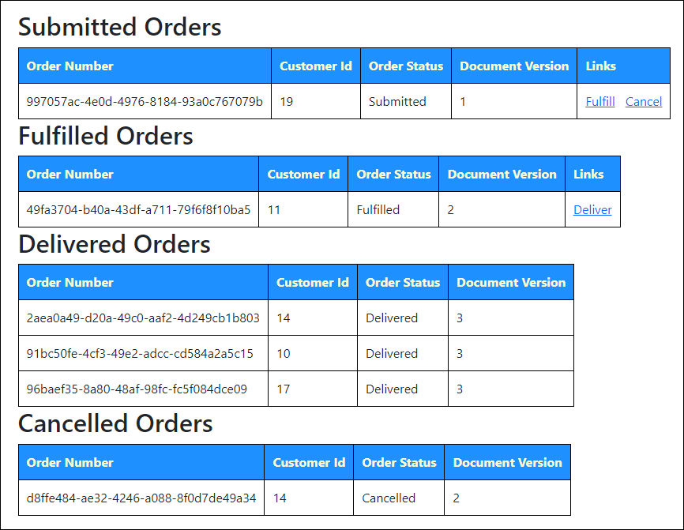
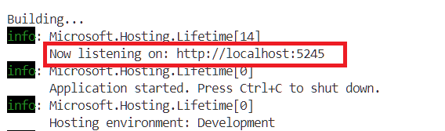
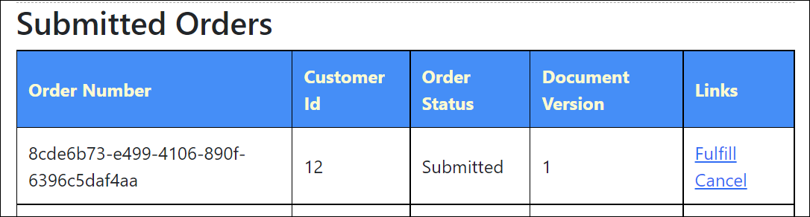
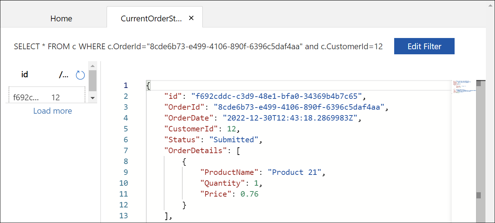

# Azure Cosmos DB design pattern: Document versioning

Document versioning is used to track the current version of a document and store historical documents in another collection. Where schema versioning tracks the schema changes, document versioning tracks the data changes. This pattern works well when there are few document versions to be tracked.

This sample demonstrates:

- ✅ It showcases how to implement document versioning in Azure Cosmos DB to track and manage the current and historical versions of documents.
- ✅  The example illustrates the separation of current document versions stored in a `CurrentOrderStatus` collection and historical document versions stored in a `HistoricalOrderStatus` collection.
- ✅ It highlights the integration of Azure Cosmos DB change feed processor running as a .NET [BackGroundService] (https://learn.microsoft.com/dotnet/architecture/microservices/multi-container-microservice-net-applications/background-tasks-with-ihostedservice) capture and copy the versioned documents to the historical collection, enabling efficient tracking and management of document versions.

## Web front end

Create orders and move them through their lifecycle (Fulfill, Deliver, Cancel) and watch each order's **document version** climb as every change is written as a new version:



## Common scenario

Some industries have regulations for data retention that require historical versions to be retained and tracked. Auditing and document control are other reasons for tracking versions. With document versioning, the current versions of documents are stored in a collection named to store the current documents. A second collection is named to store historical documents. This improves performance by allowing queries on current versions to be polled quickly without having to filter the historical results. The document versioning itself is handled at the application layer - outside of Azure Cosmos DB.

## Solution

In this example, we will explore document versioning using orders in an eCommerce environment.

Suppose we have this document:

```json
{
  "customerId": 10,
  "orderId": 1101,
  "status": "Submitted",
  "orderDetails": [
    {"productName": "Product 1", "quantity": 1},
    {"productName": "Product 2", "quantity": 3}
  ]
}
```

Now, suppose the customer had to cancel the order. The replacement document could look like this:

```json
{
  "customerId": 10,
  "orderId": 1101,
  "status": "Cancelled",
  "orderDetails": [
    {"productName": "Product 1", "quantity": 1},
    {"productName": "Product 2", "quantity": 3}
  ]
}
```

Looking at these documents, though, there is no easy way to tell which of these documents is the current document. By using document versioning, add a property to the document to track the version number. Update the current document in a `CurrentOrderStatus` container and add the change to the `HistoricalOrderStatus` container. In the project here, you can see how to implement the document versioning feature with the following components:

- A website that allows you to create orders and change the order status. The website updates the document version and saves the document to the current status container.
- An Archiver Service implemented as a .NET Background service that itself implements Cosmos DB Change Feed that sees when the Order Helper updates the order and copies the versioned document to the historical status container.

The demo website includes links to update the orders to the different statuses.



## Try this implementation

### Or Run locally

```bash
  git clone https://github.com/Azure-Samples/cosmos-db-design-patterns/
```

Directions installing pre-requisites to run locally and for cloning this repository using [Terminal or VS Code](../README.md?#getting-started)


## Set up application configuration files

You need to configure the application configuration file to run these demos.

1. Go to your resource group and select the Serverless Azure Cosmos DB for NoSQL account that you created for this repository.

1. From the navigation, under **Settings**, select **Keys** and copy the **URI** value.

### Option 1: Keyless authentication via RBAC (Recommended)

Keyless authentication using `DefaultAzureCredential` is the recommended approach. It works automatically with managed identity (Azure-hosted) and with the Azure CLI locally.

1. Assign the **Cosmos DB Built-in Data Contributor** role to your identity:

    ```bash
    az cosmosdb sql role assignment create \
      --account-name <cosmos-account-name> \
      --resource-group <resource-group-name> \
      --role-definition-name "Cosmos DB Built-in Data Contributor" \
      --principal-id $(az ad signed-in-user show --query id -o tsv) \
      --scope "/"
    ```

1. Sign in with the Azure CLI (for local development):

    ```bash
    az login
    ```

## Prepare the web app configuration

1. Open the website project and set these values as environment variables (recommended — see [Configuration and authentication](../README.md#configuration-and-authentication)), or add an **appsettings.development.json** file with the following contents:

```json
{
  "CosmosDb": {
    "CosmosUri": "<endpoint>",
    "Database": "DocumentVersionDB",
    "CurrentOrderContainer": "CurrentOrderStatus",
    "HistoricalOrderContainer": "HistoricalOrderStatus",
    "PartitionKey": "/CustomerId"
  }
}
```

1. Replace `<endpoint>` with the **URI** value copied from the Keys blade.

### Option 2: Key-based authentication (local emulator fallback)

If you are using the Azure Cosmos DB Emulator or cannot use RBAC, set `CosmosKey` as well:

1. From the Keys blade, copy both the **URI** and **PRIMARY KEY** values.

1. Open the website project and set these values as environment variables (recommended — see [Configuration and authentication](../README.md#configuration-and-authentication)), or add an **appsettings.development.json** file with the following contents:

```json
{
  "CosmosDb": {
    "CosmosUri": "<endpoint>",
    "CosmosKey": "<primary-key>",
    "Database": "DocumentVersionDB",
    "CurrentOrderContainer": "CurrentOrderStatus",
    "HistoricalOrderContainer": "HistoricalOrderStatus",
    "PartitionKey": "/CustomerId"
  }
}
```

> **Note:** Never commit `appsettings.development.json` with real key values. The `.gitignore` already excludes `appsettings.development.json`.

1. Save the file.


## Run the demo

> This sample can be run **two ways**: *all-local* (this section — your machine against the Cosmos DB emulator or your own account) or *all-Azure* (deployed and running in Azure — see [Deploy and run in Azure](#optional-deploy-and-run-in-azure-with-azd) below). You don't need Azure to learn the pattern.

1. Navigate to the `website` folder, start the website with:

```bash
  dotnet run
```

Navigate to the URL displayed in the output. In the example below, the URL is shown as part of the `info` output, following the "Now listening on:" text.




1. With the web app running, create 5-10 orders with the website.

This is what the website will look like when starting out:


The Create New Orders form will create orders without the DocumentVersion property. Enter a number in the **Number to create** text box, then select **Submit**. This is how the new order appears on the website:



This is what the new order looks like in Azure Cosmos DB. Notice that the `DocumentVersion` property is absent.



The `Archive Service` in the web application is working directly with a `VersionedDocument` type, so it will carry the `DocumentVersion` field into the `HistoricalOrderStatus` container. For new documents, this will assume the DocumentVersion is 1 when it isn't specified.

Unversioned documents will still show as document version 1 due to the `VersionedOrder` C# class.

Select any of the links in the Links columns to change the status on the document.

As you advance the status of the orders, notice that the Document Version field increments. The document version numbering is managed by the application, specifically in the `HandleVersioning()` function in the `OrderHelper` class in the `Services` folder.


You can query the `CurrentOrderStatus` container in Data Explorer for the order number (`OrderId`) and Customer Id (`CustomerId`) and should only get back 1 document - the current document.

In this example, the previously shown document was fulfilled. Notice in the Azure Data Explorer results that the `DocumentVersion` property is now a part of the document in `CurrentOrderStatus`.


You can also query the `HistoricalOrderStatus` container for that order number and customer Id and get back the entire order status history.

In this example, the previously shown document was fulfilled. Notice in the Azure Data Explorer results that the `DocumentVersion` property is now a part of the document in `CurrentOrderStatus`.


## (Optional) Deploy and run in Azure with `azd`

The steps above are the **all-local** way to run the sample. If you'd rather run the **all-Azure** way — the sample deployed and running in Azure — this pattern includes an [Azure Developer CLI (`azd`)](https://aka.ms/azd) template. Running locally is unchanged; the deployment files (`azure.yaml`, `infra/`) have no effect unless you run `azd up`.

It provisions and deploys, intentionally minimal and cheap:

- An **App Service** web app (Basic **B1** with "Always On", so the in-app Change Feed processor keeps running).
- A **serverless** Azure Cosmos DB account with local (key) authentication **disabled**.
- The web app reaches Cosmos DB **keyless**, via a **user-assigned managed identity** — no keys or connection strings are stored anywhere.

### Deploy

From the `document-versioning` folder:

```bash
azd up
```

`azd` prompts for an environment name, subscription, and location, then provisions the resources and deploys the site. When it finishes it prints the site URL — open it and create/fulfill orders exactly as in the local walkthrough above.

### Clean up

```bash
azd down
```

## Summary

The **NoSQL Document Versioning** design pattern is used in NoSQL databases to manage different versions of documents efficiently. In scenarios where documents need to be updated frequently while retaining their historical states, this pattern ensures that changes are tracked and stored without overwriting the original data.
