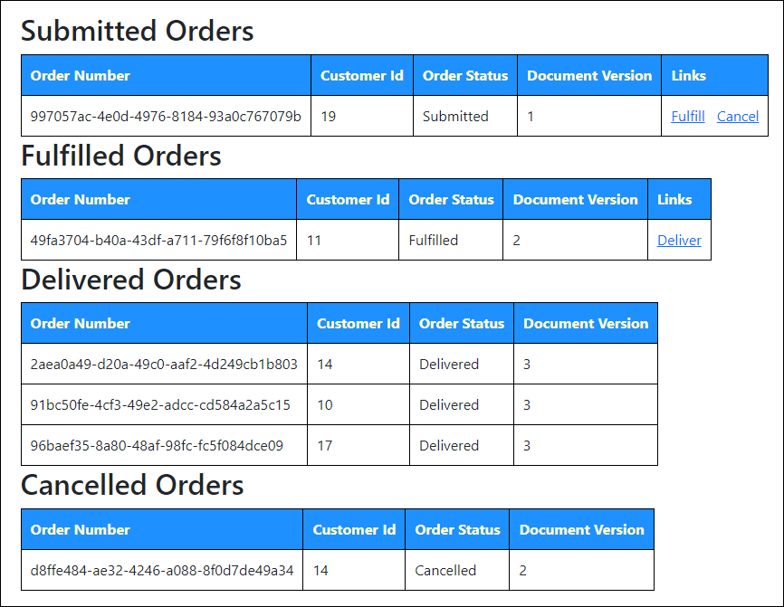

# Azure Cosmos DB design pattern: Document versioning

Document versioning is used to track the current version of a document and store historical documents in another collection. Where schema versioning tracks the schema changes, document versioning tracks the data changes. This pattern works well when there are few document versions to be tracked.

This sample demonstrates:

- ✅ It showcases how to implement document versioning in Azure Cosmos DB to track and manage the current and historical versions of documents.
- ✅  The example illustrates the separation of current document versions stored in a `CurrentOrderStatus` collection and historical document versions stored in a `HistoricalOrderStatus` collection.
- ✅ It highlights the integration of Azure Cosmos DB change feed with a function app to capture and copy the versioned documents to the historical collection, enabling efficient tracking and management of document versions.

## Common scenario

Some industries have regulations for data retention that require historical versions to be retained and tracked. Auditing and document control are other reasons for tracking versions. With document versioning, the current versions of documents are stored in a collection named to store the current documents. A second collection is named to store historical documents. This improves performance by allowing queries on current versions to be polled quickly without having to filter the historical results. The document versioning itself is handled at the application layer - outside of Azure Cosmos DB.

## Solution

In this example, we will explore document versioning using orders in an eCommerce environment.

Suppose we have this document:

```json
{
    "customerId": 10,
    "orderId": 1101,
    "status": "Submitted",
    "orderDetails": [
        [{"productName": "Product 1", "quantity": 1},
         {"productName": "Product 2", "quantity": 3}]
    ]
}
```

Now, suppose the customer had to cancel the order. The replacement document could look like this:

```json
{
    "customerId": 10,
    "orderId": 1101,
    "status": "Cancelled",
    "orderDetails": [
        [{"productName": "Product 1", "quantity": 1},
         {"productName": "Product 2", "quantity": 3}]
    ]
}
```

Looking at these documents, though, there is no easy way to tell which of these documents is the current document. By using document versioning, add a field to the document to track the version number. Update the current document in a `CurrentOrderStatus` container and add the change to the `HistoricalOrderStatus` container. While Azure Cosmos DB for NoSQL does not have a document versioning feature, you can build in the handling through an application. In [the demo](./code/setup.md), you can see how to implement the document versioning feature with the following components:

- A website that allows you to create orders and change the order status. The website updates the document version and saves the document to the current status container.
- A function app that reads the data for the Azure Cosmos DB change feed and copies the versioned documents to the historical status container

The demo website includes links to update the orders to the different statuses.



## Try this implementation

In order to run the demos, you will need:

- [.NET 6.0 Runtime](https://dotnet.microsoft.com/download/dotnet/6.0)
- [Azure Functions Core Tools v4](https://learn.microsoft.com/azure/azure-functions/functions-run-local#install-the-azure-functions-core-tools)

## Confirm required tools are installed

Confirm you have the required versions of the tools installed for this demo.

First, check the .NET runtime with this command:

```bash
dotnet --list-runtimes
```

As you may have multiple versions of the runtime installed, make sure that .NET components with versions that start with 6.0 appear as part of the output.

Next, check the version of Azure Functions Core Tools with this command:

```bash
func --version
```

You should have installed a version that starts with `4.`. If you do not have a v4 version installed, you will need to uninstall the older version and follow [these instructions for installing Azure Functions Core Tools](https://learn.microsoft.com/azure/azure-functions/functions-run-local#install-the-azure-functions-core-tools).

## Getting the code

There are a few ways you can start working with the code in this demo.

### **Clone the Repository to Your Local Computer:**

**Using the Terminal:**

- Open the terminal on your computer.
- Navigate to the directory where you want to clone the repository.
- Type `git clone https://github.com/AzureCosmosDB/design-patterns.git` and press enter.
- The repository will be cloned to your local machine.

**Using Visual Studio Code:**

- Open Visual Studio Code.
- Click on the **Source Control** icon in the left sidebar.
- Click on the **Clone Repository** button at the top of the Source Control panel.
- Paste `https://github.com/AzureCosmosDB/design-patterns.git` into the text field and press enter.
- Select a directory where you want to clone the repository.
- The repository will be cloned to your local machine.

### **Fork the Repository:**

Forking the repository allows you to create your own copy of the repository under your GitHub account. This copy is independent of the original repository and is stored on your account. You can make changes to your forked copy without affecting the original repository. To fork the repository:

- Visit the repository URL: [https://github.com/AzureCosmosDB/design-patterns](https://github.com/AzureCosmosDB/design-patterns)
- Click the "Fork" button at the top right corner of the repository page.
- Select where you want to fork the repository (your personal account or an organization).
- After forking, you'll have your own copy of the repository under your account. You can make changes, create branches, and push your changes back to your fork.
- After forking the repository, open the repository on GitHub: [https://github.com/YourUsername/design-patterns](https://github.com/YourUsername/design-patterns) (replace `YourUsername` with your GitHub username).
- Click the "Code" button and copy the URL (HTTPS or SSH) of the repository.
- Open a terminal on your local computer and navigate to the directory where you want to clone the repository using the `cd` command.
- Run the command: `git clone <repository_url>` (replace `<repository_url>` with the copied URL).
- This will create a local copy of the repository on your computer, which you can modify and work with.

### **GitHub Codespaces**

You can try out this implementation by running the code in [GitHub Codespaces](https://docs.github.com/codespaces/overview) with a [free Azure Cosmos DB account](https://learn.microsoft.com/azure/cosmos-db/try-free). (*This option doesn't require an Azure subscription, just a GitHub account.*)

- Open the application code in a GitHub Codespace:

    [](https://codespaces.new/azure-samples/cosmos-db-design-patterns?quickstart=1&devcontainer_path=.devcontainer%2Fdocument-versioning%2Fdevcontainer.json)

## Create an Azure Cosmos DB for NoSQL account

1. Create a free Azure Cosmos DB for NoSQL account: (<https://cosmos.azure.com/try>)

1. In the Data Explorer, create a new database and container with the following values:

    | | Value |
    | --- | --- |
    | **Database name** | `Orders` |
    | **Container name** | `CurrentOrderStatus` |
    | **Partition key path** | `/CustomerId` |
    | **Throughput** | `400` (*Manual*) |

1. In the Data Explorer, create a second container with the following values:

    | | Value |
    | --- | --- |
    | **Database name** | `Orders` |
    | **Container name** | `HistoricalOrderStatus` |
    | **Partition key path** | `/CustomerId` |
    | **Throughput** | `400` (*Manual*) |

## Set up application configuration file

You need to configure the application configuraiton file to run these demos.

1. Go to resource group.

1. Select the new Azure Cosmos DB for NoSQL account.

1. From the navigation, under **Settings**, select **Keys**. The values you need for the environment variables for the demo are here.

While on the Keys blade, make note of the `PRIMARY CONNECTION STRING`. You will need this for the Azure Function App.

## Prepare the function app configuration

1. Open the application code. Add a file to the `function-app` folder called **local.settings.json** with the following contents:

    ```json
    {
        "IsEncrypted": false,
        "Values": {
            "AzureWebJobsStorage": "UseDevelopmentStorage=false",
            "FUNCTIONS_WORKER_RUNTIME": "dotnet",        
            "CosmosDBConnection" : "YOUR_PRIMARY_CONNECTION_STRING"
        }
    }
    ```

    Make sure to replace `YOUR_PRIMARY_CONNECTION_STRING` with the `PRIMARY CONNECTION STRING` value noted earlier.

2. Edit **host.json** Set the `userAgentSuffix` to a value you prefer to use. This is used in tracking in Activity Monitor. See [host.json settings](https://learn.microsoft.com/azure/azure-functions/functions-bindings-cosmosdb-v2?tabs=in-process%2Cextensionv4&pivots=programming-language-csharp#hostjson-settings) for more details.

## Run the demo locally

1. Switch to the `website` folder. Then start the website with:

    ```bash
    dotnet run
    ```

    Navigate to the URL displayed in the output. In the example below, the URL is shown as part of the `info` output, following the "Now listening on:" text.

    

    **Do not doing anything on this website yet. Continue to the next step.**

1. At another command prompt, switch to the `function-app` folder. Then, run the function app with:

    ```bash
    func start
    ```

Now that you have the website and function app started, create 5-10 orders with the website.


This is what the website will look like when starting out:


 The Create New Orders form will create orders without the DocumentVersion property. Enter a number in the **Number to create** text box, then select **Submit**. This is how the new order appears on the website:


This is what the new order looks like in Azure Cosmos DB. Notice that the `DocumentVersion` property is absent.


The Azure Function is working directly with a `VersionedDocument` type, so it will carry the `DocumentVersion` field into the `HistoricalOrderStatus` container. For new documents, this will assume the DocumentVersion is 1 when it isn't specified.

Unversioned documents will still show as document version 1 due to the `VersionedOrder` C# class.

Select any of the links in the Links columns to change the status on the document.

- As you advance the status of the orders, notice that the Document Version field increments. The document version numbering is managed by the application, specifically in the `HandleVersioning()` function in the `OrderHelper` class in the `Services` folder.

    

- You can query the `CurrentOrderStatus` container in Data Explorer for the order number (`OrderId`) and Customer Id (`CustomerId`) and should only get back 1 document - the current document.

    In this example, the previously shown document was fulfilled. Notice in the Azure Data Explorer results that the `DocumentVersion` property is now a part of the document in `CurrentOrderStatus`.

    

- You can also query the `HistoricalOrderStatus` container for that order number and customer Id and get back the entire order status history.

    In this example, the previously shown document was fulfilled. Notice in the Azure Data Explorer results that the `DocumentVersion` property is now a part of the document in `CurrentOrderStatus`.

    

## Summary

The **NoSQL Document Versioning** design pattern is used in NoSQL databases to manage different versions of documents efficiently. In scenarios where documents need to be updated frequently while retaining their historical states, this pattern ensures that changes are tracked and stored without overwriting the original data.
