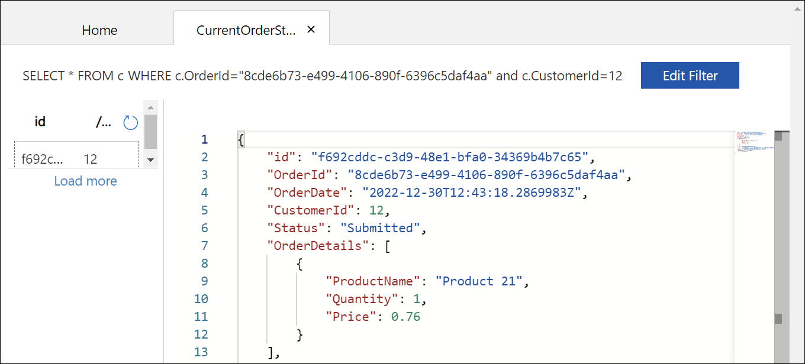

# Document Versioning

In order to run the demos, you will need:

- [.NET 6.0 Runtime](https://dotnet.microsoft.com/en-us/download/dotnet/6.0)
- [Azure Functions Core Tools v4](https://learn.microsoft.com/azure/azure-functions/functions-run-local#install-the-azure-functions-core-tools)

## Confirm required tools are installed

Confirm you have the required versions of the tools installed for this demo.

First, check the .NET runtime with this command:

```bash
dotnet --list-runtimes
```

As you may have multiple versions of the runtime installed, make sure that .NET components with versions that start with 6.0 appear as part of the output.

Next, check the version of Azure Functions Core Tools with this command:

```bash
func --version
```

You should have installed a version that starts with `4.`. If you do not have a v4 version installed, you will need to uninstall the older version and follow [these instructions for installing Azure Functions Core Tools](https://learn.microsoft.com/azure/azure-functions/functions-run-local#install-the-azure-functions-core-tools).

## Create an Azure Cosmos DB for NoSQL account

This template will create an Azure Cosmos DB for NoSQL account with a database named `Orders` with a container named `CurrentOrderStatus`. The partition key is set for `/CustomerId`. The data generator defaults to these values. This will also create a container named `HistoricalOrderStatus` with the partition key of `/CustomerId`.

The suggested account name includes 'YOUR_SUFFIX'. Change that to a suffix to make your account name unique.

The Azure Cosmos DB for NoSQL account will automatically be created with the region of the selected resource group.

There is an option to enable the free tier. This is so that others can try this out with minimal costs to them.

---

**This link will work if this is a public repo.**

[](https://portal.azure.com/#create/Microsoft.Template/uri/https%3A%2F%2Fraw.githubusercontent.com%2Fsolliancenet%2Fcosmos-db-nosql-modeling%2Fmain%2Fdocument-versioning%2Fcode%2Fazuredeploy.json)

**For the private repo**

1. [Create a custom template deployment](https://portal.azure.com/#create/Microsoft.Template/).
2. Select **Build your own template in the editor**.
3. Copy the contents from [this template](azuredeploy.json) into the editor.
4. Select **Save**.

---

Once the template is loaded, populate the values:

- **Subscription** - Choose a subscription.
- **Resource group** - Choose a resource group.
- **Region** - Select a region for the instance.
- **Location** - Enter a location for the Azure Cosmos DB for NoSQL account. **Note**: By default, it is set to use the location of the resource group. If you need to change this value, you can find the supported regions for your subscription via:
  - [Azure CLI](https://learn.microsoft.com/cli/azure/account?view=azure-cli-latest#az-account-list-locations)
  - PowerShell: `Get-AzLocation | Where-Object {$_.Providers -contains "Microsoft.DocumentDB"} | Select location`
- **Account Name** - Replace `YOUR_SUFFIX` with a suffix to make your Azure Cosmos DB account name unique.
- **Database Name** - Set to the default **Orders**.
- **Current Container Name** - This is the container partitioned by `/CustomerId`. Set to the default **CurrentOrderStatus**.
- **Historical Container Name** - This is the container partitioned by `/CustomerId`. Set to the default **HistoricalOrderStatus**.
- **Throughput** - Set to the default **400**.
- **Enable Free Tier** - This defaults to `false`. Set it to **true** if you want to use it as [the free tier account](https://learn.microsoft.com/azure/cosmos-db/free-tier).

Once those settings are set, select **Review + create**, then **Create**.

## Set up environment variables

You need 2 environment variables to run these demos.

1. Once the template deployment is complete, select **Go to resource group**.
2. Select the new Azure Cosmos DB for NoSQL account.
3. From the navigation, under **Settings**, select **Keys**. The values you need for the environment variables for the demo are here.

Create 2 environment variables to run the demos:

- `COSMOS_ENDPOINT`: set to the `URI` value on the Azure Cosmos DB account Keys blade.
- `COSMOS_KEY`: set to the Read-Write `PRIMARY KEY` for the Azure Cosmos DB for NoSQL account

Create your environment variables with the following syntax:

PowerShell:

```powershell
$env:COSMOS_ENDPOINT="YOUR_COSMOS_ENDPOINT"
$env:COSMOS_KEY="YOUR_COSMOS_READ_WRITE_PRIMARY_KEY"
```

Bash:

```bash
export COSMOS_ENDPOINT="YOUR_COSMOS_ENDPOINT"
export COSMOS_KEY="YOUR_COSMOS_KEY"
```

Windows Command:

```text
set COSMOS_ENDPOINT=YOUR_COSMOS_ENDPOINT
set COSMOS_KEY=YOUR_COSMOS_KEY
```

While on the Keys blade, make note of the `PRIMARY CONNECTION STRING`. You will need this for the Azure Function App.

## Prepare the function app configuration

1. Add a file to the `function-app` folder called **local.settings.json** with the following contents:

    ```json
    {
        "IsEncrypted": false,
        "Values": {
            "AzureWebJobsStorage": "UseDevelopmentStorage=false",
            "FUNCTIONS_WORKER_RUNTIME": "dotnet",        
            "CosmosDBConnection" : "YOUR_PRIMARY_CONNECTION_STRING"
        }
    }
    ```

    Make sure to replace `YOUR_PRIMARY_CONNECTION_STRING` with the `PRIMARY CONNECTION STRING` value noted earlier.

2. Edit **host.json** Set the `userAgentSuffix` to a value you prefer to use. This is used in tracking in Activity Monitor. See [host.json settings](https://learn.microsoft.com/en-us/azure/azure-functions/functions-bindings-cosmosdb-v2?tabs=in-process%2Cextensionv4&pivots=programming-language-csharp#hostjson-settings) for more details.

## Run the demo locally

1. Switch to the `website` folder. Then start the website with:

    ```bash
    dotnet run
    ```

    Navigate to the URL displayed in the output. In the example below, the URL is shown as part of the `info` output, following the "Now listening on:" text.

    

    **Do not doing anything on this website yet. Continue to the next step.**

2. At another command prompt, switch to the `function-app` folder. Then, run the function app with:

    ```bash
    func start
    ```

Now that you have the website and function app started, create 5-10 orders with the website.


This is what the website will look like when starting out:


 The Create New Orders form will create orders without the DocumentVersion property. Enter a number in the **Number to create** text box, then select **Submit**. This is how the new order appears on the website:


This is what the new order looks like in Azure Cosmos DB. Notice that the `DocumentVersion` property is absent.



The Azure Function is working directly with a `VersionedDocument` type, so it will carry the `DocumentVersion` field into the `HistoricalOrderStatus` container. For new documents, this will assume the DocumentVersion is 1 when it isn't specified.

Unversioned documents will still show as document version 1 due to the `VersionedOrder` C# class.

Select any of the links in the Links columns to change the status on the document.

- As you advance the status of the orders, notice that the Document Version field increments. The document version numbering is managed by the application, specifically in the `HandleVersioning()` function in the `OrderHelper` class in the `Services` folder.

    

- You can query the `CurrentOrderStatus` container in Data Explorer for the order number (`OrderId`) and Customer Id (`CustomerId`) and should only get back 1 document - the current document.

    In this example, the previously shown document was fulfilled. Notice in the Azure Data Explorer results that the `DocumentVersion` property is now a part of the document in `CurrentOrderStatus`.

    

- You can also query the `HistoricalOrderStatus` container for that order number and customer Id and get back the entire order status history.

    In this example, the previously shown document was fulfilled. Notice in the Azure Data Explorer results that the `DocumentVersion` property is now a part of the document in `CurrentOrderStatus`.

    
