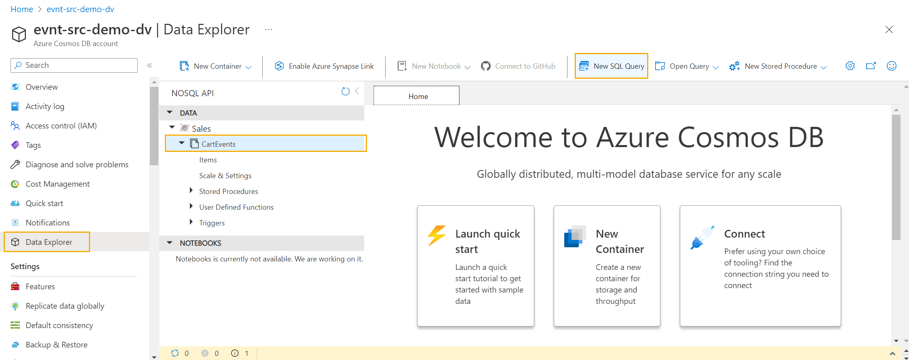

# Event Sourcing pattern

The [Event Sourcing pattern](https://learn.microsoft.com/azure/architecture/patterns/event-sourcing) is used to track append-only events (no updates or deletes) in an Azure Cosmos DB collection 
before additional processing takes place. This gives you a full log of historical events which can feed into 
multiple downstream systems. This full detail allows for calculating results at various points in time. In other 
words, you have an audit of all historical changes. When using event sourcing in Azure Cosmos DB, the change feed should 
be used to allow one or more consumers to easily process only changed data.

Event sourcing is a design pattern that involves capturing all changes to an application's state as a sequence of events. These events are then stored in a database or event log and can be replayed to rebuild the state of the application at any point in time. While event sourcing can be implemented with various types of databases, it often makes the most sense for NoSQL databases due to the following reasons:

1. Flexibility in Schema: NoSQL databases, unlike traditional relational databases, are schema-less or schema-flexible. This aligns well with event sourcing because events themselves can have varying structures as the application evolves over time. With event sourcing, each event represents a discrete change to the application's state, and the data model can evolve naturally without rigid schema constraints.

1. Scalability: NoSQL databases are designed to scale horizontally, making them well-suited for handling large volumes of writes, which is a common characteristic of event sourcing architectures. As events are continuously appended to the event log, NoSQL databases can efficiently handle write-heavy workloads, ensuring high availability and performance.

1. Handling Complex Data: Event sourcing can result in complex data structures since the state of an application is built by replaying a series of events. NoSQL databases can handle nested and hierarchical data structures better than traditional relational databases, making them more suitable for storing and querying these complex event data structures.

1. High Write Throughput: Event sourcing often involves capturing every state change as an event, which means a lot of write operations. NoSQL databases are optimized for write-heavy scenarios, and their distributed nature allows them to handle concurrent writes efficiently, making them an appropriate choice for event sourcing where maintaining the order of events is crucial.

1. Eventual Consistency: Event sourcing typically relies on eventual consistency rather than strong consistency. NoSQL databases often offer tunable consistency levels, allowing developers to balance performance and data consistency according to their requirements. This aligns with the philosophy of event sourcing, where eventual consistency is often acceptable and even desirable.

1. Support for Unstructured Data: NoSQL databases can store unstructured or semi-structured data, which aligns well with the nature of events in an event sourcing system. Events can be serialized in various formats, such as JSON or BSON, and stored directly in NoSQL databases, making it easier to work with event data without the need for complex mapping or transformations.

Despite these advantages, it's important to note that the choice of database for event sourcing depends on the specific requirements of the application and the skills and preferences of the development team. While NoSQL databases can be a good fit for many event sourcing scenarios, traditional relational databases or other data storage solutions may still be appropriate depending on the use case and the application's overall architecture.


This sample demonstrates:

- ✅ This will show how to create an Azure Function that will simulate shopping cart events for an event sourcing pattern which appends events to Azure Cosmos DB.

## Common scenario

A common scenario for using the NoSQL event sourcing data pattern is in building event-driven microservices architectures. Event sourcing can be particularly valuable in such scenarios due to its ability to capture and store all changes to an application's state as a sequence of events.

### Scenario: Event-Driven Microservices Architecture

1. Microservices Communication: In a microservices architecture, different services communicate through events. When an event occurs in one microservice, it can be published to an event bus or event stream. Other microservices can then subscribe to relevant events and react accordingly, updating their own state based on the received events.

1. Decoupled Components: Event sourcing allows microservices to be loosely coupled. Each microservice focuses on handling its own events and state changes without needing to know the internal workings of other services. This leads to better separation of concerns and enables each microservice to evolve independently.

1. Scalability: As microservices communicate through events, they can scale independently to handle varying workloads. NoSQL databases, which are often used in event sourcing, are designed to scale horizontally, making them well-suited for supporting the high throughput of events generated and consumed by microservices.

1. Resilience and Event Replay: In the event of failures or system crashes, event sourcing enables easy recovery by replaying events from the event log. By replaying the events, the application can reconstruct its state and continue processing from the point of failure, ensuring data consistency and reliability.

1. Audit and Compliance: Event sourcing provides a complete history of events and state changes, offering a robust audit trail. This is valuable for compliance purposes and helps track and understand how the system reached its current state.

1. Event Versioning and Evolution: As services evolve, events can be versioned, and new event types can be introduced. This allows smooth integration with both new and old versions of services. NoSQL databases' flexibility in handling different data structures makes it easier to handle event versioning.

1. Event Replay for Testing and Analytics: Event sourcing allows easy replication of events for testing and analytics purposes. Developers can use a test environment to replay events and verify the behavior of services, while data analysts can analyze the historical event log for insights and business intelligence.

Overall, the NoSQL event sourcing data pattern is well-suited for event-driven microservices architectures, enabling scalability, resilience, and loose coupling among microservices. It's important to design the events carefully and choose the appropriate NoSQL database that fits the application's requirements and expected event throughput. Additionally, this pattern requires careful consideration of event schema evolution to ensure backward and forward compatibility as services evolve over time.

## Soulution

This pattern provides:
- A full log of events, useful for auditing or point in time calculations.
- Reduces risk of conflicting updates
- Change feed capability to enable multiple consumers to process new events.
- [Materialized Views pattern](../materialized_views/README.md) using change feed builds off the event store created with this pattern to support multiple views off the same source data.
## Sample implementation of event sourcing
In this section we will walk through a case study on how to design and implement event sourcing.

We will walk through code examples and review cost considerations that will impact the design.

Consider a shopping cart application for an eCommerce company. All changes to the cart should be tracked as events 
but will be queried for multiple uses by different consuming services. Event sourcing pattern is chosen to ensure all history is retained and point 
in time state can be calculated. Each time a change is made to the cart there will be multiple calculations 
downstream. Rather than have the application update multiple containers, the single 
event store collection `shopping_cart_event` will be appended with the change. The partition key will be `/cartId` to support the most common queries by the shopping cart service. Other services will consume data from the change feed and use solutions like [materialized views](../materialized_views/README.md) to support different query patterns.

In this example the state of all products in the cart is maintained as `productsInCart`. However, this could also be derived by each query or consumer if the application that writes the data does not know the full state.

Sample events in the event store would look like this:
```json
{
  "cartId": guid,
  "sessionId": guid,
  "userId": guid,
  "eventType": "cart_created",
  "eventTimestamp": "2022-11-28 01:22:04"
},
{
  "cartId": guid,
  "sessionId": guid,
  "userId": guid,
  "eventType": "product_added",
  "product": "Product 1",
  "quantityChange": 1,
  "productsInCart": [{"productName": "Product 1", "quantity": 1}],
  "eventTimestamp": "2022-11-28 01:22:34"
},
{
  "cartId": guid,
  "sessionId": guid,
  "userId": guid,
  "eventType": "product_added",
  "product": "Product 2",
  "quantityChange": 3,
  "productsInCart": [{"productName": "Product 1", "quantity": 1},
                     {"productName": "Product 2", "quantity": 3}],
  "eventTimestamp": "2022-11-28 01:22:58"
},
{
  "cartId": guid,
  "sessionId": guid,
  "userId": guid,
  "eventType": "product_deleted",
  "product": "Product 2",
  "quantityChange": -1,
  "productsInCart": [{"productName": "Product 1", "quantity": 1},
                     {"productName": "Product 2", "quantity": 2}],
  "eventTimestamp": "2022-11-28 01:23:12"
},
{
  "cartId": guid,
  "sessionId": guid,
  "userId": guid,
  "eventType": "cart_purchased",
  "productsInCart": [{"productName": "Product 1", "quantity": 1},
                     {"productName": "Product 2", "quantity": 2}],
  "eventTimestamp": "2022-11-28 01:24:45"
}
```

## Try this implementation

To run the function app for Bucketing pattern, you will need to have:

- [.NET 6.0 Runtime](https://dotnet.microsoft.com/en-us/download/dotnet/6.0)
- [Azure Functions Core Tools](https://learn.microsoft.com/azure/azure-functions/functions-run-local#install-the-azure-functions-core-tools)

## Confirm required tools are installed

Confirm you have the required versions of the tools installed for this demo.

First, check the .NET runtime with this command:

```bash
dotnet --list-runtimes
```

As you may have multiple versions of the runtime installed, make sure that .NET components with versions that start with 6.0 appear as part of the output.

Next, check the version of Azure Functions Core Tools with this command:

```bash
func --version
```

You should have a version 4._x_ installed. If you do not have this version installed, you will need to uninstall the older version and follow [these instructions for installing Azure Functions Core Tools](https://learn.microsoft.com/azure/azure-functions/functions-run-local#install-the-azure-functions-core-tools).

## Create an Azure Cosmos DB for NoSQL account

You can try out this implementation by running the code in [GitHub Codespaces](https://docs.github.com/codespaces/overview) with a [free Azure Cosmos DB account](https://learn.microsoft.com/azure/cosmos-db/try-free). (*This option doesn't require an Azure subscription, just a GitHub account.*)

1. Create a free Azure Cosmos DB for NoSQL account: (<https://cosmos.azure.com/try>)

1. Open the new account in the Azure portal and record the **URI** and **PRIMARY KEY** fields. These fields can be found in the **Keys** section of the account's page within the portal.

1. In the Data Explorer, create a new database and container with the following values:

    | | Value |
    | --- | --- |
    | **Database name** | `Sales` |
    | **Container name** | `CartEvents` |
    | **Partition key path** | `/CartId` |
    | **Throughput** | `400` (*Manual*) |

## Get Cosmos DB connection information

You will need a connection string for the Cosmos DB account.

1. Once the template deployment is complete, select **Go to resource group**.
2. Select the new Azure Cosmos DB for NoSQL account.
3. From the navigation, under **Settings**, select **Keys**. The values you need for the environment variables for the demo are here.

## Prepare the function app configuration

1. Add a file to the `Cosmos_Patterns_EventSourcing` folder called **local.settings.json** with the following contents:

    ```json
    {
        "IsEncrypted": false,
        "Values": {
            "AzureWebJobsStorage": "UseDevelopmentStorage=true",
            "FUNCTIONS_WORKER_RUNTIME": "dotnet",        
            "CosmosDBConnection" : "YOUR_PRIMARY_CONNECTION_STRING"
        }
    }
    ```

Make sure to replace `YOUR_PRIMARY_CONNECTION_STRING` with the `PRIMARY CONNECTION STRING` value noted earlier.

2. Edit **host.json** Set the `userAgentSuffix` to a value you prefer to use. This is used in tracking in Activity Monitor. See [host.json settings](https://learn.microsoft.com/en-us/azure/azure-functions/functions-bindings-cosmosdb-v2?tabs=in-process%2Cextensionv4&pivots=programming-language-csharp#hostjson-settings) for more details.

## Run the demo

1. Start the function app to wait for HTTP calls. Each call should have a payload of a single CartEvent, then the function will save it to Azure Cosmos DB.

```bash
func start
```

To trigger the function to generate events and send to the function, you can make HTTP calls with each CartEvent sent as JSON. Review and run Program.cs to see this in action.

Open a new terminal and run the included Console App (Program.cs) which generates simple shopping cart events:
```bash
dotnet run
```

## Querying the event source data
Once you have run [the demo](./code/setup.md) which generates data, you can run queries directly against the event source container by using **Data Explorer** in the Azure Portal.

1. In Azure Portal, browse to you Azure Cosmos DB resource.
2. Select **Data Explorer** in the left menu.
3. Select your container, then choose **New SQL Query**. 


The most common query for this append-only store is to retrieve events for a specific `CartId`, ordered by `EventTimestamp`. In this case only the latest event for a cart is needed to know the last status and what products were in the cart.

The Console App (started with `dotnet run`) used in the demo will print out `CartId` values as it creates events.
```
HTTP function successful for event cart_created for cart 38f4687d-35f2-4933-aadd-8776f4134589.
```
Copy the query below and paste into the query pane in Data Explorer. **Replace the CartId value** with a GUID copied from the Console App program output.

```sql
SELECT *
FROM CartEvents c
WHERE c.CartId = "38f4687d-35f2-4933-aadd-8776f4134589"
ORDER BY c.EventTimestamp DESC
```

More complex queries can be run on the events container directly. Ideally, they will still use the partitionKey to optimize costs while the change feed is used to build other views when needed. One example is if the source application did not track the `productsInCart` information. In that case the product and quantities in the cart can be derived with a slightly more complex query. This query returns a record per product with the final quantity. It filters to a specific cart and also ignores the events that do not include a product, such as cart creation or purchase. You can test this in Data Explorer, but remember to replace the CartId value with one generated by running the demo.

```sql
SELECT c.CartId, c.UserId, c.Product,
    Sum(c.QuantityChange) as Quantity
FROM CartEvents c
WHERE c.CartId = "38f4687d-35f2-4933-aadd-8776f4134589"
    and IS_NULL(c.Product) = false 
GROUP BY c.CartId, c.UserId, c.Product
```

## Summary

The event sourcing pattern makes sense for developers as it provides a full historical record of an application's state, enabling easy recovery from failures and ensuring data resilience. It supports scalable architectures, decoupled microservices, and flexible data schema, making it suitable for modern distributed systems. With an audit trail for compliance and regulatory requirements, event sourcing enhances system transparency. It also simplifies testing, analytics, and event versioning, empowering developers to build robust and adaptable applications that can evolve seamlessly over time.