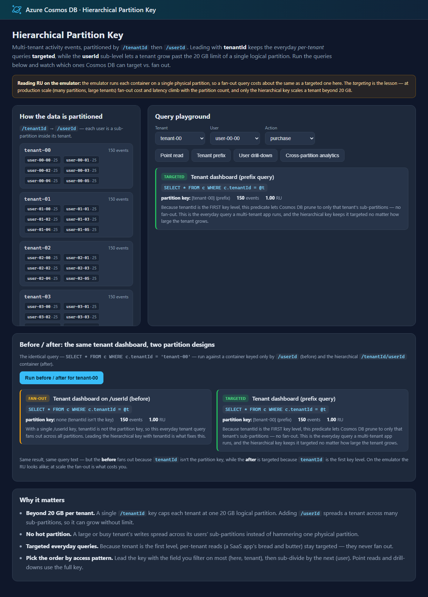

# Azure Cosmos DB design pattern: Hierarchical Partition Key

Choosing a partition key is the single most important data-modeling decision in Azure Cosmos DB — and the one relational developers find least familiar. A **hierarchical partition key** (also called subpartitioning) lets you use **up to three levels** — for example `/tenantId` then `/userId` — instead of a single value. That solves two problems a single-level key runs into at scale:

1. **The 20 GB logical-partition limit.** With a single `/tenantId` key, all of a tenant's data lives in one logical partition, which is capped at 20 GB — a busy tenant will hit the wall. Adding `/userId` spreads that tenant across many sub-partitions, so it can grow without limit.
2. **Hot partitions and fan-out queries.** Leading the key with `tenantId` means the everyday *per-tenant* query stays **targeted** (it reads only that tenant's partitions), while writes spread across the tenant's users instead of hammering one partition.

This sample demonstrates:

- ✅ Declaring a **hierarchical (MultiHash) partition key** with multiple paths
- ✅ **Targeted** reads/queries — point read (full key), tenant **prefix**, and tenant + user
- ✅ How the **same query** is targeted on the hierarchical container but **fans out** on a single-key container
- ✅ An interactive playground that annotates *why* each query is targeted or a fan-out

## Web front end

Run each read/query and see whether Cosmos DB could target specific partitions or had to fan out, with a talking-point for each — plus a before/after comparing the same tenant query on a `/userId` container vs. the hierarchical `/tenantId/userId` container:



## Common scenario

Multi-tenant SaaS is the classic case. A shared container holds data for many tenants; each tenant has many users, each with lots of data:

- **Activity / audit events**, **documents**, **orders**, **messages** — anything where a tenant is the natural top-level scope.
- Partition by **`/tenantId` then `/userId`** (optionally a third level such as `/sessionId`).
- The common access pattern — "everything for tenant A" — is a targeted prefix query, and a large tenant is no longer boxed into a single 20 GB logical partition.

Other natural hierarchies: `deviceId → date` (IoT), `workspaceId → channelId` (chat), `storeId → customerId` (retail).

## Sample implementation

The sample stores user **activity events** for several tenants. The `Events` container uses a hierarchical key; a second `EventsByUser` container (single `/userId` key) exists only for the before/after comparison.

**Declaring the hierarchical key** is just multiple paths (`source/HierarchicalPartitionKey/ActivityStore.cs`):

```csharp
await database.CreateContainerIfNotExistsAsync(new ContainerProperties
{
    Id = "Events",
    PartitionKeyPaths = new List<string> { "/tenantId", "/userId" }, // hierarchical (MultiHash)
});
```

**Writing** uses the full key via `PartitionKeyBuilder`:

```csharp
await container.UpsertItemAsync(ev, new PartitionKeyBuilder().Add(ev.TenantId).Add(ev.UserId).Build());
```

**Reading** targets partitions by using the key fields:

```csharp
// Point read — full key, cheapest possible.
await container.ReadItemAsync<ActivityEvent>(id, new PartitionKeyBuilder().Add(tenantId).Add(userId).Build());

// Tenant dashboard — filter on the FIRST key level; Cosmos prunes to that tenant's sub-partitions.
"SELECT * FROM c WHERE c.tenantId = @t"

// User drill-down — filter on BOTH levels; targets a single sub-partition.
"SELECT * FROM c WHERE c.tenantId = @t AND c.userId = @u"
```

The key insight the before/after shows: the **same** query `SELECT * FROM c WHERE c.tenantId = @t` is **targeted** on the hierarchical container (tenantId is the first key level, so partitions are pruned) but a **fan-out** on the `/userId` container (tenantId isn't the key). The partition-key *design* — not the query — is what makes the difference.

This sample ships two ways to explore the pattern:

- An **interactive web front end** (`source/Website`) — a partition tree, a query playground that labels each query **targeted** or **fan-out** with a talking-point, and a before/after comparison.
- A **console app** (`source/Console`) that runs each read/query and prints what Cosmos DB did.

> **Honest note about the emulator.** The cost/performance payoff of this pattern is a **production-scale** effect. The Cosmos DB emulator runs each container on a **single physical partition**, so a fan-out query costs about the same RU as a targeted one locally — the emulator can't reproduce the difference. The *targeting* (and the 20 GB scaling benefit) is the lesson; at production scale, fan-out cost and latency grow with the number of partitions. Also note the emulator does **not** apply a partial partition key passed in query request options as a filter, so this sample filters with a `WHERE` predicate on the key paths — which returns correct results everywhere and enables partition pruning in production.

## Getting the code

### Using Terminal or VS Code

Directions for installing pre-requisites and cloning this repository are in the [root README](../README.md#getting-started).

## Set up application configuration

Each app reads `CosmosUri` (and optionally `CosmosKey`) from configuration. See [Configuration and authentication](../README.md#configuration-and-authentication) in the root README. When nothing is configured, both apps **default to the local emulator** (`https://localhost:8081`), so they run with zero setup.

## Run the demo locally

Start the local emulator first (see the [root README](../README.md#run-locally-with-the-emulator-default)), or point at your own account:

```bash
docker compose up -d
```

### Interactive web front end (recommended)

```bash
cd source/Website
dotnet run
```

Open the URL it prints. Pick a tenant and user, then run the different queries and watch the **targeted / fan-out** labels and talking-points. Use **Run before / after** to compare the same tenant query on the two partition designs.

### Console app

```bash
cd source/Console
dotnet run
```

The console seeds the data and runs each read/query, printing the query, the partition key used, the result count, and why it was targeted or a fan-out.

## (Optional) Deploy and run in Azure with `azd`

The steps above run the sample **all-local**. To run the **all-Azure** way — the web front end hosted in Azure over a keyless Cosmos DB account — this pattern includes an [Azure Developer CLI (`azd`)](https://aka.ms/azd) template. Running locally is unchanged; the deployment files (`azure.yaml`, `infra/`) have no effect unless you run `azd up`.

It provisions and deploys, intentionally minimal and cheap:

- An **App Service** web app (Basic **B1**, **Always On**) that seeds and serves the front end.
- A **serverless** Azure Cosmos DB account with local (key) authentication **disabled**, with the `ActivityDB` database and two pre-created containers: `Events` (hierarchical `/tenantId/userId`) and `EventsByUser` (`/userId`). A partition key can only be set when the container is created.
- The web app reaches Cosmos DB **keyless**, via a **user-assigned managed identity** — no keys or connection strings are stored anywhere. The deploying user is also granted data access so you can run the console app locally against the same account.

### Deploy

From the `hierarchical-partition-key` folder:

```bash
azd up
```

### Clean up

```bash
azd down
```

## Summary

A hierarchical partition key lets a single logical scope (a tenant) grow beyond the 20 GB limit of one partition and keeps the most common access pattern — per-tenant reads — targeted rather than fanning out. Lead the key with the field you filter on most, then sub-divide by the next. The payoff is a production-scale one, but the modeling and query mechanics are exactly what this sample makes concrete.
