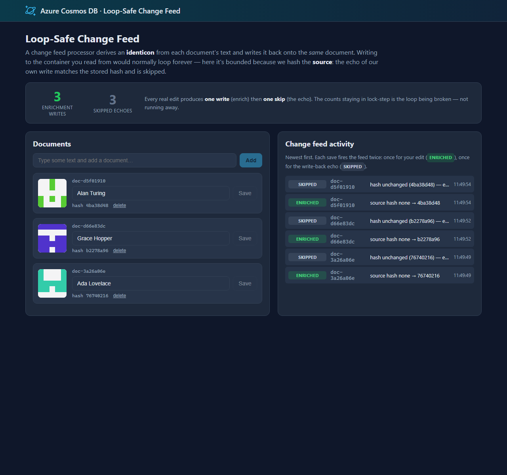

# Azure Cosmos DB design pattern: Loop-Safe Change Feed

A very common need is to **derive** something from a document and store the result **on the same document** — a search-normalized field, a translation, a sentiment score, an embedding vector, or (in this sample) a small **identicon** image. The Azure Cosmos DB [change feed](https://learn.microsoft.com/azure/cosmos-db/nosql/change-feed-processor) is the natural way to do this: it hands you every create and update, you compute the derived value, and you write it back.

The catch: **writing back to the same container you're reading from re-triggers the change feed.** Your write is itself a change, which fires the processor again, which writes again… an **infinite loop** that burns request units forever.

This sample shows the standard way to make that safe. It stores a **hash of the source** on the document. Every time the change feed delivers a document, the processor recomputes the source hash and compares it to the stored one:

- **Hashes differ** (or none is stored) → the source really changed. Compute the derived value, store it **plus the new hash**, and write.
- **Hashes match** → this is the *echo of our own write*. Skip it. Because we skip, there is no second write, so the loop stops after exactly one enrichment.

This sample demonstrates:

- ✅ In-place enrichment driven by the **Change Feed Processor** (no Azure Functions required)
- ✅ A **hash of the source** as the loop guard, so writing back can't run away
- ✅ **Idempotent** processing — the same change delivered twice is a no-op (change feed is at-least-once)
- ✅ **Optimistic concurrency** (ETag) so a concurrent user edit is never clobbered
- ✅ An interactive web front end that makes the "one enrich, then one skip" behavior visible

> **Credit:** the mechanism in this sample is a generalized, dependency-free adaptation of the [Azure Cosmos DB Embeddings Generator](https://github.com/AzureCosmosDB/cosmos-embeddings-generator), which uses the same source-hash technique to avoid loops while generating Azure OpenAI embeddings in place.

## Web front end

Add documents and edit their text, and watch each **identicon** appear a moment later as the change feed enriches the document in place. The **enrichment writes** and **skipped echoes** counters climb together — one of each per edit — and the activity timeline shows exactly one `ENRICHED` followed by one `SKIPPED` per change. That lock-step is the loop being bounded instead of running away.



## Common scenario

Any time you want a document to carry a value *derived from its own contents*, and you want that value kept up to date automatically as the contents change:

1. **AI enrichment** — generate an embedding vector, a summary, a translation, or a classification for a text field and store it alongside the text (this is exactly what the embeddings-generator does).
2. **Search preparation** — derive a lowercased, accent-stripped, tokenized field so queries can match case-insensitively.
3. **Denormalized/derived fields** — a slug from a title, a full name from parts, a geohash from coordinates, a risk score from several fields.
4. **Media/metadata** — here, a deterministic **identicon** image derived from the text.

In every case the tricky part is the same — enriching *in place* without looping — and the solution is the same: hash the source.

## Sample implementation

The derived value in this sample is an **identicon**: a GitHub-style 5×5 symmetric avatar rendered as an inline SVG, generated deterministically from the source hash. It's a great fit for teaching the pattern because the picture **is** a visualization of the hash — when you edit the text, the hash changes, so the avatar visibly changes; when nothing meaningful changed, the avatar stays the same and the change is skipped.

The core logic lives in `source/Enrichment` and is deliberately tiny and dependency-free:

- **`SourceHasher`** — SHA-256 of the source property's value.
- **`IdenticonGenerator`** — turns a hash into an SVG string (pure string/crypto; no packages). This is the *pluggable* step: replace it with a call to Azure OpenAI, a translator, a classifier, etc.
- **`DocumentEnricher`** — the decision, isolated from Cosmos DB so it's trivial to reason about:

  ```csharp
  string newHash = SourceHasher.Compute(document[options.SourceProperty]?.ToString());
  string? storedHash = document[options.HashProperty]?.ToString();

  if (newHash == storedHash)
      return EnrichmentDecision.Skipped(storedHash);   // echo of our own write — stop the loop

  document[options.EnrichedProperty] = IdenticonGenerator.ToSvg(newHash);
  document[options.HashProperty] = newHash;            // hash covers the SOURCE only
  return EnrichmentDecision.Enriched(storedHash, newHash);
  ```

- **`ChangeFeedEnrichmentProcessor`** — hosts a Cosmos DB Change Feed Processor (with a **lease** container) on the `Documents` container and applies `DocumentEnricher` to each change, writing back with an **ETag** check.

The single most important rule: **the hash covers the source property only — never the derived value or the hash itself.** That's what guarantees the write-back doesn't change the hash, so the echo is always recognized and skipped.

Every property name is configurable (`EnrichmentOptions`), so the pattern is generic:

| Setting | Default | Purpose |
| --- | --- | --- |
| `SourceProperty` | `text` | the input the derived value is computed from |
| `EnrichedProperty` | `identicon` | where the derived value is stored |
| `HashProperty` | `sourceHash` | the loop-guard hash of the source |

This sample ships two ways to explore the pattern:

- An **interactive web front end** (`source/Website`) — add and edit documents, watch each identicon appear a moment after you save, and follow a live **change feed activity** timeline showing one `ENRICHED` per edit followed by exactly one `SKIPPED` echo. A **writes-vs-skips** counter stays in lock-step, which *is* the loop being bounded.
- A **console processor** (`source/Processor`) — starts the processor and makes a few edits, printing the same enrich/skip sequence and a final summary. A quick, scriptable way to see the mechanism.

## Getting the code

### Using Terminal or VS Code

Directions for installing pre-requisites and cloning this repository are in the [root README](../README.md#getting-started).

## Set up application configuration

Each app reads `CosmosUri` (and optionally `CosmosKey`) from configuration. See [Configuration and authentication](../README.md#configuration-and-authentication) in the root README. When nothing is configured, both apps **default to the local emulator** (`https://localhost:8081`), so they run with zero setup.

## Run the demo locally

Start the local emulator first (see the [root README](../README.md#run-locally-with-the-emulator-default)), or point at your own account:

```bash
docker compose up -d
```

### Interactive web front end (recommended)

```bash
cd source/Website
dotnet run
```

Open the URL it prints. Add a document with some text and click **Add** — a moment later its colorful identicon appears (the processor enriched it). Now edit the text and click **Save**: the identicon changes, and the timeline shows a new `ENRICHED` followed by a `SKIPPED`. Notice the **enrichment writes** and **skipped echoes** counters climbing together — one of each per edit. That lock-step is the loop being broken instead of running away.

### Console processor

```bash
cd source/Processor
dotnet run
```

The console starts the processor and makes four source edits. Watch each edit produce one `ENRICHED` (a write-back) and one `SKIPPED` (the echo), then a summary confirming the change feed didn't loop.

## (Optional) Deploy and run in Azure with `azd`

The steps above run the sample **all-local**. To run the **all-Azure** way — the web front end hosted in Azure over a keyless Cosmos DB account — this pattern includes an [Azure Developer CLI (`azd`)](https://aka.ms/azd) template. Running locally is unchanged; the deployment files (`azure.yaml`, `infra/`) have no effect unless you run `azd up`.

It provisions and deploys, intentionally minimal and cheap:

- An **App Service** web app (Basic **B1**, **Always On**) that hosts the Change Feed processor in-process and serves the front end.
- A **serverless** Azure Cosmos DB account with local (key) authentication **disabled**, with the `EnrichDB` database and the `Documents` and `leases` containers pre-created.
- The web app reaches Cosmos DB **keyless**, via a **user-assigned managed identity** — no keys or connection strings are stored anywhere. The deploying user is also granted data access so you can run the console processor locally against the same account.

### Deploy

From the `loop-safe-change-feed` folder:

```bash
azd up
```

### Clean up

```bash
azd down
```

## Summary

Enriching documents in place from the change feed is powerful but has one sharp edge: writing to the container you read from re-triggers the feed. Storing a **hash of the source** and skipping changes whose hash is unchanged turns that endless loop into exactly one write per real edit — and, as a bonus, makes processing idempotent. Swap the identicon step for embeddings, translation, or any other enrichment and the loop-safety guarantee still holds.
