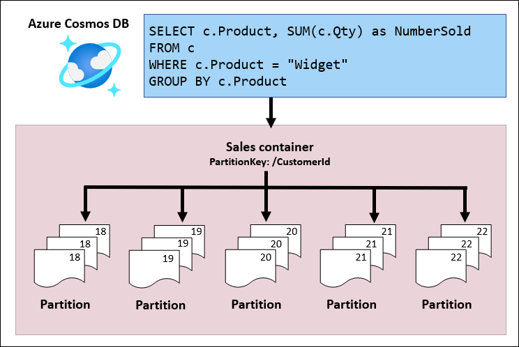

# Materialized views

In NoSQL databases, materialized views are precomputed, persisted data structures that store the results of complex queries to improve query performance and reduce the need for repeated computations.

Materialized views present data optimized for read-only activities. The [Materialized View pattern](https://learn.microsoft.com/azure/architecture/patterns/materialized-view) is a pattern used when the data is written with a strategy that does not align with frequent querying.

Data may be written in a way that makes sense for the source. For example, sales data may be written as it comes in for each sales transaction and stored by a customer. However, when the data is queried commonly in a different way than the source, it makes sense to create read-only views that are maintained as changes come in. With sales data, it is commonly queried by product, aggregated for each customer, and aggregated for all customers. Having materialized views for these queries means that the data is already structured to make the query more efficient.


This sample demonstrates:

- ✅ Implementing materialized views using the change feed.
- ✅ Look at a query meant for the Product partitioned container and how it runs in the two different containers.
- ✅ Test an in-partition query to make note of the difference in performance.
 
## Common scenario

Materialized views offer a valuable means of enhancing query performance by precomputing and storing optimized data representations. This process involves creating derived tables that capture and preserve the results of specific queries. By doing so, materialized views address the need for faster and more efficient data retrieval.

In practice, materialized views find application in a variety of scenarios, each catering to different optimization requirements:

1. **Views with Different Partition Keys:** Materialized views can be tailored to accommodate diverse partition keys, allowing for more efficient organization and retrieval of data based on varying criteria. This capability is particularly beneficial in systems where data needs to be accessed and manipulated using multiple perspectives.

1. **Subsets of Data:** When working with large datasets, it often makes sense to focus on specific subsets of information that are frequently queried. Materialized views can be employed to create summarized versions of these subsets, optimizing access to relevant data and minimizing the need for resource-intensive full-table scans.

1. **Aggregate Views:** Analytical queries frequently involve aggregations, such as sum, average, or count, performed on certain data attributes. Materialized views can precompute these aggregations, enabling swift execution of analytical queries without the need to repeatedly process the raw data.

In essence, materialized views serve as a performance-enhancing layer that strikes a balance between data storage and retrieval efficiency. By precomputing and storing query results, these views significantly reduce the computational burden during query execution, leading to quicker responses and improved overall system responsiveness.

### Scenario: Implementation of materialized views for different partition keys

In this section, we will look at implementing materialized views using the change feed.

Suppose Tailspin Toys stores its sales information in Azure Cosmos DB for NoSQL. As the sales details are coming, the sales details are written to a container named `Sales` and partitioned by the `/CustomerId`. However, the eCommerce site wants to show the products that are popular now, so it wants to show products with the most sales. Rather than querying the partitions by `CustomerId`, it makes more sense to query a container partitioned by the `Product`. The Azure Cosmos DB change feed can be used to help create the materialized view to speed up queries over a year.

In the following diagram, there is a single Azure Cosmos DB for NoSQL account with two containers. The primary container is named **Sales** and stores the sales information. The secondary container named **SalesByProduct** stores the sales information by product, to meet Tailspin Toys' requirements for showing popular products.

 starts with a container Sales that holds data with one partition key. The Azure Cosmos DB change feed captures the data written to Sales, and the Azure Function processing the change feed writes the data to the SalesByDate container that is partitioned by the year.](./images/materialized-views-aggregates.png)

When implementing the materialized view pattern, there is a container for each materialized view.

Why would you want to create two containers? Why does the partition key matter? Consider the following query to get the sum of quantities sold for a particular product:

```sql
SELECT c.Product, SUM(c.Qty) as NumberSold FROM c WHERE c.Product = "Widget" GROUP BY c.Product
```

When running this query for the Sales container - the container where the source data is stored, Azure Cosmos DB will look at the WHERE clause and try to identify the partitions that contain the data filtered in the WHERE clause. When the partition key is not in the WHERE clause, Azure Cosmos DB will query all partitions. For this query, all customers may have widgets sold, so Azure Cosmos DB will query all customers' partitions for widget sales.



However, when running the query to get the totals for a product in the SalesByProduct container, Azure Cosmos DB will only need to query one partition - the partition that holds the data for the product in the WHERE clause.


In the demo, you may not see the performance implications with smaller sets of data - smaller in terms of the amount of data overall as well as diversity in the `CustomerId` column. However, when your data grows beyond 50 GB in storage or throughput of 10000 RU/s, you will see the performance implications at scale.

**Note**: If you are running into aggregation analysis at scale, the materialized views would not be advised. For large-scale analysis, consider [Azure Cosmos DB analytical store](https://learn.microsoft.com/azure/cosmos-db/analytical-store-introduction) and [Azure Synapse Link for Azure Cosmos DB](https://learn.microsoft.com/azure/cosmos-db/synapse-link).

## Try this implementation

To run this demo, you will need to have:

- [.NET 6.0 Runtime](https://dotnet.microsoft.com/download/dotnet/6.0)
- [Azure Functions Core Tools](https://learn.microsoft.com/azure/azure-functions/functions-run-local#install-the-azure-functions-core-tools)

## Confirm required tools are installed

Confirm you have the required versions of the tools installed for this demo.

First, check the .NET runtime with this command:

```bash
dotnet --list-runtimes
```

As you may have multiple versions of the runtime installed, make sure that .NET components with versions that start with 6.0 appear as part of the output.

Next, check the version of Azure Functions Core Tools with this command:

```bash
func --version
```

You should have a version 4._x_ installed. If you do not have this version installed, you will need to uninstall the older version and follow [these instructions for installing Azure Functions Core Tools](https://learn.microsoft.com/azure/azure-functions/functions-run-local#install-the-azure-functions-core-tools).

## Getting the code

There are a few ways you can start working with the code in this demo.

### **Clone the Repository to Your Local Computer:**

**Using the Terminal:**

- Open the terminal on your computer.
- Navigate to the directory where you want to clone the repository.
- Type `git clone https://github.com/AzureCosmosDB/design-patterns.git` and press enter.
- The repository will be cloned to your local machine.

**Using Visual Studio Code:**

- Open Visual Studio Code.
- Click on the **Source Control** icon in the left sidebar.
- Click on the **Clone Repository** button at the top of the Source Control panel.
- Paste `https://github.com/AzureCosmosDB/design-patterns.git` into the text field and press enter.
- Select a directory where you want to clone the repository.
- The repository will be cloned to your local machine.

### **Fork the Repository:**

Forking the repository allows you to create your own copy of the repository under your GitHub account. This copy is independent of the original repository and is stored on your account. You can make changes to your forked copy without affecting the original repository. To fork the repository:

- Visit the repository URL: [https://github.com/AzureCosmosDB/design-patterns](https://github.com/AzureCosmosDB/design-patterns)
- Click the "Fork" button at the top right corner of the repository page.
- Select where you want to fork the repository (your personal account or an organization).
- After forking, you'll have your own copy of the repository under your account. You can make changes, create branches, and push your changes back to your fork.
- After forking the repository, open the repository on GitHub: [https://github.com/YourUsername/design-patterns](https://github.com/YourUsername/design-patterns) (replace `YourUsername` with your GitHub username).
- Click the "Code" button and copy the URL (HTTPS or SSH) of the repository.
- Open a terminal on your local computer and navigate to the directory where you want to clone the repository using the `cd` command.
- Run the command: `git clone <repository_url>` (replace `<repository_url>` with the copied URL).
- This will create a local copy of the repository on your computer, which you can modify and work with.

### **GitHub Codespaces**

You can try out this implementation by running the code in [GitHub Codespaces](https://docs.github.com/codespaces/overview) with a [free Azure Cosmos DB account](https://learn.microsoft.com/azure/cosmos-db/try-free). (*This option doesn't require an Azure subscription, just a GitHub account.*)

- Open the application code in a GitHub Codespace:

    [](https://codespaces.new/azure-samples/cosmos-db-design-patterns?quickstart=1&devcontainer_path=.devcontainer%2Fmaterialized-view%2Fdevcontainer.json)

## Create an Azure Cosmos DB for NoSQL account

1. Create a free Azure Cosmos DB for NoSQL account: (<https://cosmos.azure.com/try>)

1. In the Data Explorer, create a new database and container with the following values:

    | | Value |
    | --- | --- |
    | **Database name** | `Sales` |
    | **Container name** | `Sales` |
    | **Partition key path** | `/CustomerId` |
    | **Throughput** | `400` (*Manual*) |

1. In the Data Explorer, create a second container with the following values:

    | | Value |
    | --- | --- |
    | **Database name** | `Orders` |
    | **Container name** | `SalesByProduct` |
    | **Partition key path** | `/Product` |
    | **Throughput** | `400` (*Manual*) |

## Get Azure Cosmos DB connection information

You will need a connection string for the Azure Cosmos DB account.

1. Go to resource group

1. Select the new Azure Cosmos DB for NoSQL account.

1. From the navigation, under **Settings**, select **Keys**. The values you need for the environment variables for the demo are here.

Create 2 environment variables to run the demos:

- `COSMOS_ENDPOINT`: set to the `URI` value on the Azure Cosmos DB account Keys blade.
- `COSMOS_KEY`: set to the Read-Write `PRIMARY KEY` for the Azure Cosmos DB for NoSQL account

Create your environment variables in a bash terminal with the following syntax:

```bash
export COSMOS_ENDPOINT="YOUR_COSMOS_ENDPOINT"
export COSMOS_KEY="YOUR_COSMOS_KEY"
```

1. While on the Keys blade, make note of the `PRIMARY CONNECTION STRING`. You will need this for the Azure Function App.

## Generate data

Open the application code.

Run the data generator to generate sales data.

```bash
cd ./data-generator
dotnet run
```

## Prepare the function app configuration

1. Add a file to the `function-app` folder called **local.settings.json** with the following contents:

    ```json
    {
        "IsEncrypted": false,
        "Values": {
            "AzureWebJobsStorage": "UseDevelopmentStorage=false",
            "FUNCTIONS_WORKER_RUNTIME": "dotnet",        
            "CosmosDBConnection" : "YOUR_PRIMARY_CONNECTION_STRING"
        }
    }
    ```

    Make sure to replace `YOUR_PRIMARY_CONNECTION_STRING` with the `PRIMARY CONNECTION STRING` value noted earlier.

2. Edit **host.json** Set the `userAgentSuffix` to a value you prefer to use. This is used in tracking in Activity Monitor. See [host.json settings](https://learn.microsoft.com/azure/azure-functions/functions-bindings-cosmosdb-v2?tabs=in-process%2Cextensionv4&pivots=programming-language-csharp#hostjson-settings) for more details.

## Run the demo locally

1. Switch to the `function-app` folder. Then start the function with:

    ```dotnetcli
    func start
    ```

2. At another command prompt, switch to the `data-generator` folder. Run the data generator with:

    ```dotnetcli
    dotnet run
    ```

As the data generator runs, switch to the function app's command window and show the logging to demonstrate what's happening using the change feed.

You can confirm the entries by looking at the Sales and SalesByProduct containers in Data Explorer in the Azure portal in the Azure Cosmos DB for NoSQL account. 

## Run an in-partition query

In this part, you will look at a query meant for the Product partitioned container and how it runs in the two different containers. This is the query that will be used:

```sql
SELECT c.Product, SUM(c.Qty) as NumberSold FROM c WHERE c.Product = "Widget" GROUP BY c.Product
```

### Run the query in the Sales container

Once data is loaded, you can test an in-partition query to make note of the difference in performance.

1. Open the Azure Cosmos DB for NoSQL account in the Azure portal.
2. From the lefthand navigation, select **Data Explorer**.
3. In the NOSQL API navigation, expand the **Sales** database and the **Sales** container.
4. Select the ellipsis at the end of **Items**, then select **New SQL Query**.
5. In the query window, enter the following query:

    ```sql
    SELECT c.Product, SUM(c.Qty) as NumberSold FROM c WHERE c.Product = "Widget" GROUP BY c.Product
    ```

6. Select **Execute Query**.

Look at the values under **Query Stats**. For this demo, pay close attention to the **Index lookup time**. In this example, the query was run over 50 documents in the **Sales** container. The index lookup time came back at 0.17 ms


### Run the query in the SalesByProduct container

1. In the NOSQL API Navigation, in the **Sales** database, expand the **SalesByProduct** container.
2. Select the ellipsis at the end of **Items**, then select **New SQL Query**.
3. In the query window, enter the following query:

    ```sql
    SELECT c.Product, SUM(c.Qty) as NumberSold FROM c WHERE c.Product = "Widget" GROUP BY c.Product
    ```

4. Select **Execute Query**.

Make note of the values under **Query Stats**. These are the stats for the query when the partition key is in the WHERE clause.

Look at the values under **Query Stats**. For this demo, pay close attention to the **Index lookup time**. In this example, the query was run over the 50 documents only in the **SalesByProduct** container. The index lookup time came back at 0.08 ms.


## Summary
When deciding what field to use for the partition key, keep in mind the queries you use and how you filter your data. A materialized view for your query can significantly improve the performance.
