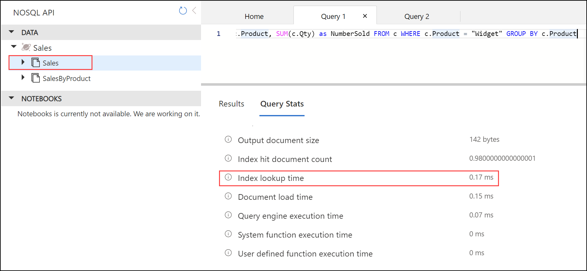
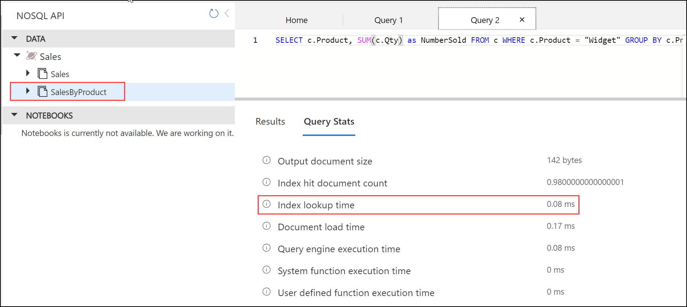

# Materialized Views demo

To run this demo, you will need to have:

- [.NET 6.0 Runtime](https://dotnet.microsoft.com/en-us/download/dotnet/6.0)
- [Azure Functions Core Tools v4](https://learn.microsoft.com/azure/azure-functions/functions-run-local#install-the-azure-functions-core-tools)

## Confirm required tools are installed

Confirm you have the required versions of the tools installed for this demo.

First, check the .NET runtime with this command:

```bash
dotnet --list-runtimes
```

As you may have multiple versions of the runtime installed, make sure that .NET components with versions that start with 6.0 appear as part of the output.

Next, check the version of Azure Functions Core Tools with this command:

```bash
func --version
```

You should have installed a version that starts with `4.`. If you do not have a v4 version installed, you will need to uninstall the older version and follow [these instructions for installing Azure Functions Core Tools](https://learn.microsoft.com/azure/azure-functions/functions-run-local#install-the-azure-functions-core-tools).

## Create an Azure Cosmos DB for NoSQL account

This template will create an Azure Cosmos DB for NoSQL account with a database named `Sales` with a container named `Sales`. The partition key is set for `/CustomerId`. The data generator defaults to these values. This will also create a container named `SalesByDate` with the partition key of `/Product`.

The suggested account name includes 'YOUR_SUFFIX'. Change that to a suffix to make your account name unique.

The Azure Cosmos DB for NoSQL account will automatically be created with the region of the selected resource group.

There is an option to enable the free tier. This is so that others can try this out with minimal costs to them.

---

**This link will work if this is a public repo.**

[](https://portal.azure.com/#create/Microsoft.Template/uri/https%3A%2F%2Fraw.githubusercontent.com%2Fsolliancenet%2Fcosmos-db-nosql-modeling%2Fmain%2Fmaterialized_views%2Fcode%2Fazuredeploy.json)

**For the private repo**

1. [Create a custom template deployment](https://portal.azure.com/#create/Microsoft.Template/).
2. Select **Build your own template in the editor**.
3. Copy the contents from [this template](azuredeploy.json) into the editor.
4. Select **Save**.

---

Once the template is loaded, populate the values:

- **Subscription** - Choose a subscription.
- **Resource group** - Choose a resource group.
- **Region** - Select a region for the instance.
- **Location** - Enter a location for the Azure Cosmos DB for NoSQL account. **Note**: By default, it is set to use the location of the resource group. If you need to change this value, you can find the supported regions for your subscription via:
  - [Azure CLI](https://learn.microsoft.com/cli/azure/account?view=azure-cli-latest#az-account-list-locations)
  - PowerShell: `Get-AzLocation | Where-Object {$_.Providers -contains "Microsoft.DocumentDB"} | Select location`
- **Account Name** - Replace `YOUR_SUFFIX` with a suffix to make your Azure Cosmos DB account name unique.
- **Database Name** - Set to the default **Sales**.
- **Customers Container Name** - This is the container partitioned by `/CustomerId`. Set to the default **Sales**.
- **Products Container Name** - This is the container partitioned by `/Product`. Set to the default **SalesByProduct**.
- **Throughput** - Set to the default **400**.
- **Enable Free Tier** - This defaults to `false`. Set it to **true** if you want to use it as [the free tier account](https://learn.microsoft.com/azure/cosmos-db/free-tier).

Once those settings are set, select **Review + create**, then **Create**.

## Set up environment variables

You need 2 environment variables to run these demos.

1. Once the template deployment is complete, select **Go to resource group**.
2. Select the new Azure Cosmos DB for NoSQL account.
3. From the navigation, under **Settings**, select **Keys**. The values you need for the environment variables for the demo are here.

Create 2 environment variables to run the demos:

- `COSMOS_ENDPOINT`: set to the `URI` value on the Azure Cosmos DB account Keys blade.
- `COSMOS_KEY`: set to the Read-Write `PRIMARY KEY` for the Azure Cosmos DB for NoSQL account

Create your environment variables with the following syntax:

PowerShell:

```powershell
$env:COSMOS_ENDPOINT="YOUR_COSMOS_ENDPOINT"
$env:COSMOS_KEY="YOUR_COSMOS_READ_WRITE_PRIMARY_KEY"
```

Bash:

```bash
export COSMOS_ENDPOINT="YOUR_COSMOS_ENDPOINT"
export COSMOS_KEY="YOUR_COSMOS_KEY"
```

Windows Command:

```text
set COSMOS_ENDPOINT=YOUR_COSMOS_ENDPOINT
set COSMOS_KEY=YOUR_COSMOS_KEY
```

While on the Keys blade, make note of the `PRIMARY CONNECTION STRING`. You will need this for the Azure Function App.

## Generate data

Run the data generator to generate sales data.

```bash
cd ./data-generator
dotnet run
```

## Prepare the function app configuration

1. Add a file to the `function-app` folder called **local.settings.json** with the following contents:

    ```json
    {
        "IsEncrypted": false,
        "Values": {
            "AzureWebJobsStorage": "UseDevelopmentStorage=false",
            "FUNCTIONS_WORKER_RUNTIME": "dotnet",        
            "CosmosDBConnection" : "YOUR_PRIMARY_CONNECTION_STRING"
        }
    }
    ```

    Make sure to replace `YOUR_PRIMARY_CONNECTION_STRING` with the `PRIMARY CONNECTION STRING` value noted earlier.

2. Edit **host.json** Set the `userAgentSuffix` to a value you prefer to use. This is used in tracking in Activity Monitor. See [host.json settings](https://learn.microsoft.com/en-us/azure/azure-functions/functions-bindings-cosmosdb-v2?tabs=in-process%2Cextensionv4&pivots=programming-language-csharp#hostjson-settings) for more details.

## Run the demo locally

1. Switch to the `function-app` folder. Then start the function with:

    ```dotnetcli
    func start
    ```

2. At another command prompt, switch to the `data-generator` folder. Run the data generator with:

    ```dotnetcli
    dotnet run
    ```

As the data generator runs, switch to the function app's command window and show the logging to demonstrate what's happening using the change feed.

You can confirm the entries by looking at the Sales and SalesByProduct containers in Data Explorer in the Azure portal in the Azure Cosmos DB for NoSQL account. 

## Run an in-partition query

In this part, you will look at a query meant for the Product partitioned container and how it runs in the two different containers. This is the query that will be used:

```sql
SELECT c.Product, SUM(c.Qty) as NumberSold FROM c WHERE c.Product = "Widget" GROUP BY c.Product
```

### Run the query in the Sales container

Once data is loaded, you can test an in-partition query to make note of the difference in performance.

1. Open the Azure Cosmos DB for NoSQL account in the Azure portal.
2. From the lefthand navigation, select **Data Explorer**.
3. In the NOSQL API navigation, expand the **Sales** database and the **Sales** container.
4. Select the ellipsis at the end of **Items**, then select **New SQL Query**.
5. In the query window, enter the following query:

    ```sql
    SELECT c.Product, SUM(c.Qty) as NumberSold FROM c WHERE c.Product = "Widget" GROUP BY c.Product
    ```

6. Select **Execute Query**.

Look at the values under **Query Stats**. For this demo, pay close attention to the **Index lookup time**. In this example, the query was run over 50 documents in the **Sales** container. The index lookup time came back at 0.17 ms



### Run the query in the SalesByProduct container

1. In the NOSQL API Navigation, in the **Sales** database, expand the **SalesByProduct** container.
2. Select the ellipsis at the end of **Items**, then select **New SQL Query**.
3. In the query window, enter the following query:

    ```sql
    SELECT c.Product, SUM(c.Qty) as NumberSold FROM c WHERE c.Product = "Widget" GROUP BY c.Product
    ```

4. Select **Execute Query**.

Make note of the values under **Query Stats**. These are the stats for the query when the partition key is in the WHERE clause.

Look at the values under **Query Stats**. For this demo, pay close attention to the **Index lookup time**. In this example, the query was run over the 50 documents only in the **SalesByProduct** container. The index lookup time came back at 0.08 ms.



When deciding what field to use for the partition key, keep in mind the queries you use and how you filter your data. A materialized view for your query can significantly improve the performance.
