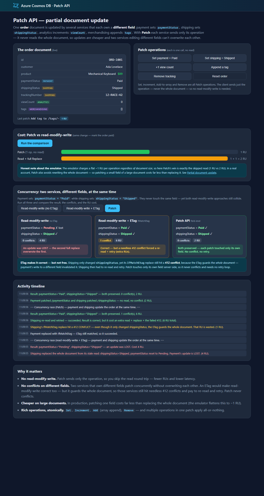

# Azure Cosmos DB design pattern: Patch API (partial document update)

Changing one field of a document usually means a **read-modify-write**: read the whole document, change a field in memory, and write the whole document back. That has three costs:

1. **An extra round trip** — you pay request units (RUs) and latency for the read *and* the write.
2. **A full rewrite** — you send and re-index the entire document even to flip a single boolean; on large documents that is a lot of wasted RUs.
3. **Lost updates** — if two callers read the same document, change *different* fields, and both write the whole document back, the second write silently overwrites the first caller's field. Guarding against this needs optimistic concurrency (ETags) and a retry loop.

The **Patch API** ([partial document update](https://learn.microsoft.com/azure/cosmos-db/partial-document-update)) fixes all three. You send only the **operations** you want applied — `Set`, `Increment`, `Add` (array append), `Remove`, `Replace` — and the server applies them in place:

```csharp
await container.PatchItemAsync<Order>(id, new PartitionKey(orderId), new[]
{
    PatchOperation.Set("/paymentStatus", "Paid"),
    PatchOperation.Increment("/viewCount", 1),
    PatchOperation.Add("/tags/-", "gift"),
});
```

No read first, only the delta on the wire, and — because each caller touches only its own field — no lost updates when different services update different fields.

This sample demonstrates:

- ✅ Patch operations: **Set**, **Increment**, array **Add**, and **Remove**
- ✅ A measured **RU comparison** — Patch vs read-modify-write for the same change
- ✅ A **concurrency race** run three ways — read-modify-write (loses an update), read-modify-write **+ ETag** (correct, but a needless 412 conflict + retry), and **Patch** (correct, no conflict)
- ✅ Multiple operations applied **atomically** in a single patch

## Web front end

One order document is updated by several services that each own a different field. Apply patch operations and watch the live document; run the **RU comparison**; then run the **concurrency race** three ways and see read-modify-write lose the payment update, read-modify-write **+ ETag** hit a needless 412 conflict, and Patch keep both cheaply.



## Common scenario

Any document with fields that are updated frequently and independently:

- **Order / fulfillment** — payment sets `paymentStatus`, shipping sets `shippingStatus`/`trackingNumber`, analytics increments a view counter. Each service patches only its field.
- **User profile / session** — update `lastSeen`, a preference, or a counter without rewriting the profile.
- **Game or IoT state** — increment a score, append an event, or flip a flag on a large state document cheaply.

## Sample implementation

The `OrderStore` container holds a single order the demo mutates (`source/PatchApi/PatchOrderService.cs`). Every mutating call is a `PatchItemAsync` — the client sends only the operation, never the whole document:

```csharp
// Payment service — set one field, no read:
await container.PatchItemAsync<Order>(id, new PartitionKey(orderId),
    new[] { PatchOperation.Set("/paymentStatus", "Paid") });

// Analytics service — increment a counter, no read:
await container.PatchItemAsync<Order>(id, new PartitionKey(orderId),
    new[] { PatchOperation.Increment("/viewCount", 1) });
```

**RU cost.** The sample applies the same change (mark the order paid) with a Patch and with a read-modify-write, reading `RequestCharge` from each response. Patch skips the read, so it costs less. On the **emulator** every point operation is a flat ~1 RU *regardless of document size*, so the visible win is exactly the skipped read (Patch **~1 RU** vs read + replace **~2 RU**). In a **real account**, Patch *also* avoids rewriting the whole document, so patching a small field of a large document is far cheaper than replacing it — a benefit the emulator's flat RU charging doesn't show. The web app calls this out honestly.

**No needless conflicts on different fields.** The concurrency race has two services update *different* fields at the same time, run three ways. The RU figures below are the sample's own measurements against the local emulator (each point operation is a flat ~1 RU there):

| Approach | Result | Conflicts | RU |
| --- | --- | --- | --- |
| Read-modify-write, no ETag | ❌ payment's update **lost** | 0 | 4 |
| Read-modify-write **+ ETag** (`IfMatchEtag`) | ✅ correct, after a re-read + retry | **1** | 6 |
| **Patch** | ✅ correct | 0 | **2** |

The naive read-modify-write silently loses an update. Adding an ETag makes it *correct* — but the ETag guards the **whole document**, so the second service hits a **412 Precondition Failed** even though it only changed a different field, and must re-read and retry. That extra work is the higher RU cost. Patch touches only its own field server-side, so it never conflicts:

```csharp
// Read-modify-write + ETag: shipping changed only /shippingStatus, but its ETag is stale
// because payment wrote /paymentStatus first -> 412 Precondition Failed -> re-read and retry.
await container.ReplaceItemAsync(shippingView, id, pk,
    new ItemRequestOptions { IfMatchEtag = staleEtag }); // throws 412

// Patch: each service patches only its own field -> both survive, no ETag, no retry.
await Task.WhenAll(
    container.PatchItemAsync<Order>(id, pk, new[] { PatchOperation.Set("/paymentStatus", "Paid") }),
    container.PatchItemAsync<Order>(id, pk, new[] { PatchOperation.Set("/shippingStatus", "Shipped") }));
```

This sample ships two ways to explore the pattern:

- An **interactive web front end** (`source/Website`) — the patch-operations playground, RU comparison, and concurrency race described above.
- A **console app** (`source/Console`) that runs the patch operations, prints the RU comparison, and runs the concurrency race all three ways.

> **Patch vs. lost updates on the *same* field.** Patch avoids conflicts when callers touch *different* fields. If two callers patch the *same* field (for example, both `Set` the same status), the last one still wins. For that case use `Increment` where the change is additive, or optimistic concurrency with an ETag (`IfMatchEtag`) — accepting the conflict/retry cost shown above.

## Getting the code

### Using Terminal or VS Code

Directions for installing pre-requisites and cloning this repository are in the [root README](../README.md#getting-started).

## Set up application configuration

Each app reads `CosmosUri` (and optionally `CosmosKey`) from configuration. See [Configuration and authentication](../README.md#configuration-and-authentication) in the root README. When nothing is configured, both apps **default to the local emulator** (`https://localhost:8081`), so they run with zero setup.

## Run the demo locally

Start the local emulator first (see the [root README](../README.md#run-locally-with-the-emulator-default)), or point at your own account:

```bash
docker compose up -d
```

### Interactive web front end (recommended)

```bash
cd source/Website
dotnet run
```

Open the URL it prints. Apply a few patch operations and watch the live document, run the **RU comparison**, then run the **concurrency race** both ways.

### Console app

```bash
cd source/Console
dotnet run
```

The console runs the patch operations, prints the Patch-vs-read-modify-write RU comparison, and runs the concurrency race in both modes.

## (Optional) Deploy and run in Azure with `azd`

The steps above run the sample **all-local**. To run the **all-Azure** way — the web front end hosted in Azure over a keyless Cosmos DB account — this pattern includes an [Azure Developer CLI (`azd`)](https://aka.ms/azd) template. Running locally is unchanged; the deployment files (`azure.yaml`, `infra/`) have no effect unless you run `azd up`.

It provisions and deploys, intentionally minimal and cheap:

- An **App Service** web app (Basic **B1**) that serves the front end.
- A **serverless** Azure Cosmos DB account with local (key) authentication **disabled**, with the `PatchApiDB` database and `OrderStore` container pre-created.
- The web app reaches Cosmos DB **keyless**, via a **user-assigned managed identity** — no keys or connection strings are stored anywhere. The deploying user is also granted data access so you can run the console app locally against the same account.

### Deploy

From the `patch-api` folder:

```bash
azd up
```

### Clean up

```bash
azd down
```

## Summary

The Patch API turns a read-modify-write into a single server-side operation. You pay for one request instead of two, you send only the fields that changed instead of the whole document, and callers that own different fields can update the same document concurrently without overwriting each other. For frequently-updated documents this means fewer RUs, lower latency, and simpler code — no read round trip and no optimistic-concurrency retry loop for independent fields.
