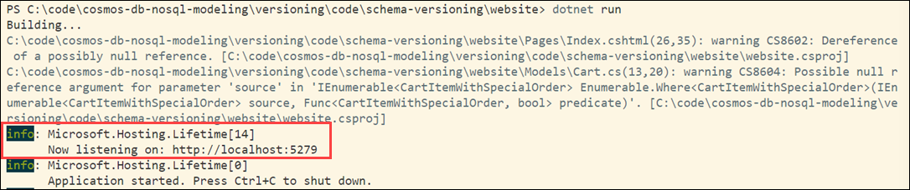

# Azure Cosmos DB design pattern: Schema versioning

Schema versioning is used to track the schema changes of a document. The schema version can be tracked in a field in the document, such as `SchemaVersion`. If a document does not have the field present, it could be assumed to be the original version of the document.

Schema versioning allows NoSQL databases to evolve with applications, minimizing disruptions and preserving data integrity. However, managing schema versioning requires a clear strategy and processes to handle changes effectively.

This sample demonstrates:

- ✅ Using a data generator to generate data with an original schema, and data with a schema-version.
- ✅ Running a website to show data generated in Azure Cosmos DB.

## Common scenario

A major benefit of NoSQL databases is its ability to handle changes to schema. This is especially helpful in cases where an application has gone into production and it is necessary to adapt to changing data requirements. NoSQL databases like Azure Cosmos DB, not only make it possible to adapt to these changes but also to enable versioning of these changes by adding an additional property to track which version of the changes the data represents. This version can be used to handle and process the changing data at run-time.

## Sample implementation of schema versioning

In this scenario we have an online retailer, Wide World Importers, with data in Azure Cosmos DB for NoSQL. This is the initial cart object in their application.

```csharp
public class Cart
{
    [JsonProperty("id")]
    public string Id { get; set; } = Guid.NewGuid().ToString();
    public string SessionId { get; set; } = Guid.NewGuid().ToString();
    public int CustomerId { get; set; }
    public List<CartItem>? Items { get; set;}
}

public class CartItem {
    public string ProductName { get; set; } = "";
    public int Quantity { get; set; }
}
```

When stored in Azure Cosmos DB for NoSQL, a cart would look like this:

```json
{
  "id": "194d7453-d9db-496b-834b-7b2db408e4be",
  "SessionId": "98f5621e-b1af-44f1-815c-f4aac728c4d4",
  "CustomerId": 741,
  "Items": [
    {
      "ProductName": "Product 23",
      "Quantity": 4
    },
    {
      "ProductName": "Product 16",
      "Quantity": 3
    }
  ]
}
```

This model was initially designed assuming products were ordered as-is without customizations. However, after feedback, they realized they needed to track special order details. It does not make sense to update all cart items with this feature, so adding a schema version property to the cart can be used to distinguish schema changes. The changes in the document would be handled at the application level.

This could be the updated class with schema versioning:

```csharp
public class CartWithVersion
{
    [JsonProperty("id")]
    public string Id { get; set; } = Guid.NewGuid().ToString();
    public string SessionId { get; set; } = Guid.NewGuid().ToString();
    public int CustomerId { get; set; }
    public List<CartItemWithSpecialOrder>? Items { get; set;}
    // Track the schema version
    public int SchemaVersion = 2;
}

public class CartItemWithSpecialOrder : CartItem {
    public bool IsSpecialOrder { get; set; } = false;
    public string? SpecialOrderNotes {  get; set; }
}
```

An updated cart in Azure Cosmos DB for NoSQL would look like this:

```json
{
  "SchemaVersion": 2,
  "id": "9baf08d2-e119-46a1-92d7-d94ee59d7270",
  "SessionId": "39306d1b-d8d8-424a-aa8b-800df123cb3c",
  "CustomerId": 827,
  "Items": [
    {
      "IsSpecialOrder": false,
      "SpecialOrderNotes": null,
      "ProductName": "Product 4",
      "Quantity": 2
    },
    {
      "IsSpecialOrder": true,
      "SpecialOrderNotes": "Special Order Details for Product 22",
      "ProductName": "Product 22",
      "Quantity": 2
    },
    {
      "IsSpecialOrder": true,
      "SpecialOrderNotes": "Special Order Details for Product 15",
      "ProductName": "Product 15",
      "Quantity": 3
    }
  ]
}
```

When it comes to data modeling, a schema version field in a JSON document can be incremented when schema changes happen. This could be used if data modeling happens with one team while development is handled separately. They could have a schema version document to help track these changes. In this example, it could look something like this:

---
**Filename**: schema.md

**Schema Updates**:

| Version | Notes |
|---------|-------|
| 2 | Added special order details to cart items |
| (null) | original release |

---

If you use a nullable type for the version, this will allow the developers to check for the presence of a value and act accordingly.

In this demo, `SchemaVersion` is treated as a nullable integer with the `int?` data type. The developers added a `HasSpecialOrders()` method to help determine whether to show the special order details. This is what the Cart class looks like on the website side:

```csharp
public class Cart
{
    [JsonProperty("id")]
    public string Id { get; set; } = Guid.NewGuid().ToString();
    public string SessionId { get; set; } = Guid.NewGuid().ToString();
    public long CustomerId { get; set; }
    public List<CartItemWithSpecialOrder>? Items { get; set;}
    public int? SchemaVersion {get; set;}
    public bool HasSpecialOrders() {
        return this.Items.Where(x=>x.IsSpecialOrder == true).Count() > 0;
    }
}
```


## Try this implementation

> This sample can be run **two ways**: *all-local* (this section — your machine or Codespaces against the Cosmos DB emulator or your own account) or *all-Azure* (deployed and running in Azure — see [Deploy and run in Azure](#optional-deploy-and-run-in-azure-with-azd) below). You don't need Azure to learn the pattern.

You can run this sample locally or in GitHub Codespaces:

### GitHub Codespaces

Open the application code in GitHub Codespaces:

  [](https://codespaces.new/azure-samples/cosmos-db-design-patterns?quickstart=1&devcontainer_path=.devcontainer%2Fschema-versioning%2Fdevcontainer.json)


### Run locally

```bash
  git clone https://github.com/Azure-Samples/cosmos-db-design-patterns/
```

### Prerequisites

If running locally you will need to install .NET 10.

- [.NET 10.0 SDK](https://dotnet.microsoft.com/download/dotnet/10.0)

To confirm you have the required versions of the tools installed.

First, check the .NET runtime with this command. Make sure that .NET components with versions that start with 10.0 appear as part of the output:

```bash
dotnet --list-runtimes
```


## Set up application configuration files

You need to configure **two** application configuration files to run these demos.

1. Go to your resource group and select the Serverless Azure Cosmos DB for NoSQL account that you created for this repository.

1. From the navigation, under **Settings**, select **Keys** and copy the **URI** value.

### Option 1: Keyless authentication via RBAC (Recommended)

Keyless authentication using `DefaultAzureCredential` is the recommended approach. It works automatically with managed identity (Azure-hosted) and with the Azure CLI locally.

1. Assign the **Cosmos DB Built-in Data Contributor** role to your identity:

    ```bash
    az cosmosdb sql role assignment create \
      --account-name <cosmos-account-name> \
      --resource-group <resource-group-name> \
      --role-definition-name "Cosmos DB Built-in Data Contributor" \
      --principal-id $(az ad signed-in-user show --query id -o tsv) \
      --scope "/"
    ```

1. Sign in with the Azure CLI (for local development):

    ```bash
    az login
    ```

1. In Codespace or locally, open the data-generator folder and set these values as environment variables (recommended — see [Configuration and authentication](../README.md#configuration-and-authentication)), or add an **appsettings.development.json** file with the following contents:

  ```json
  {
    "CosmosUri": "<endpoint>",
    "DatabaseName": "SchemaVersionDB",
    "ContainerName": "ShoppingCart",
    "PartitionKeyPath": "/id"
  }
  ```

1. Replace `<endpoint>` with the **URI** value copied from the Keys blade.

1. Open the website folder and set these values as environment variables (recommended — see [Configuration and authentication](../README.md#configuration-and-authentication)), or add an **appsettings.development.json** file with the following contents:

  ```json
  {
    "CosmosDb": {
      "CosmosUri": "<endpoint>",
      "DatabaseName": "SchemaVersionDB",
      "ContainerName": "ShoppingCart",
      "PartitionKeyPath": "/id"
    }
  }
  ```

1. Save both files.

### Option 2: Key-based authentication (local emulator fallback)

If you are using the Azure Cosmos DB Emulator or cannot use RBAC, set `CosmosKey` as well:

1. From the Keys blade, copy both the **URI** and **PRIMARY KEY** values.

1. In the data-generator **appsettings.development.json** file:

  ```json
  {
    "CosmosUri": "<endpoint>",
    "CosmosKey": "<primary-key>",
    "DatabaseName": "SchemaVersionDB",
    "ContainerName": "ShoppingCart",
    "PartitionKeyPath": "/id"
  }
  ```

1. In the website **appsettings.development.json** file:

  ```json
  {
    "CosmosDb": {
      "CosmosUri": "<endpoint>",
      "CosmosKey": "<primary-key>",
      "DatabaseName": "SchemaVersionDB",
      "ContainerName": "ShoppingCart",
      "PartitionKeyPath": "/id"
    }
  }
  ```

> **Note:** Never commit `appsettings.development.json` with real key values. The `.gitignore` already excludes `appsettings.development.json`.

1. Save both files.


## Generate data

Navigate to the data-generator folder. Run the data generator to generate original carts and schema-versioned carts.

```bash
cd ./data-generator
dotnet run
```

The number of carts that you specify will be doubled. The generator generates the same number of original carts and versioned carts.

The output will look something like this:

```bash
This code will generate sample carts and create them in an Azure Cosmos DB for NoSQL account.
The primary key for this container will be /id.


Enter the database name [default:CartsDemo]:

Enter the container name [default:Carts]:

How many carts should be created?
3
Check Carts for new carts
Press Enter to exit.
```

## Run the website to show generated data

Run the website to display the carts.

```bash
cd ./website
dotnet run
```

Navigate to the URL displayed in the output. In the example below, the URL is shown as part of the `info` output, following the "Now listening on: " text.



The output will show a variety of randomly generated carts and include the schema version when populated. When a cart contains no special items, the Special Order Notes field will not appear in the cart table.


## (Optional) Deploy and run in Azure with `azd`

The steps above are the **all-local** way to run the sample. If you'd rather run the **all-Azure** way — the sample deployed and running in Azure — this pattern includes an [Azure Developer CLI (`azd`)](https://aka.ms/azd) template. Running locally is unchanged; the deployment files (`azure.yaml`, `infra/`) have no effect unless you run `azd up`.

It provisions and deploys, intentionally minimal and cheap:

- An **App Service** web app (Basic **B1**).
- A **serverless** Azure Cosmos DB account with local (key) authentication **disabled**.
- The web app reaches Cosmos DB **keyless**, via a **user-assigned managed identity** — no keys or connection strings are stored anywhere.

### Deploy

From the `schema-versioning` folder:

```bash
azd up
```

`azd` prompts for an environment name, subscription, and location, then provisions the resources and deploys the site. When it finishes it prints the site URL — open it to see the schema-versioned carts exactly as in the local walkthrough above.

### Clean up

```bash
azd down
```

## Summary

Schema versioning is a valuable design pattern within Azure Cosmos DB. Azure Cosmos DB's schema-less nature aligns well with schema versioning. As applications evolve, schema changes can be seamlessly introduced without disrupting existing data. The ability to coexist with multiple schema versions guarantees backward compatibility. Applications can function with data in both old and new formats during the transition period.

In summary, schema versioning is a crucial design pattern for Azure Cosmos DB, promoting agility, compatibility, and robust data management within the dynamic landscape of modern applications.
