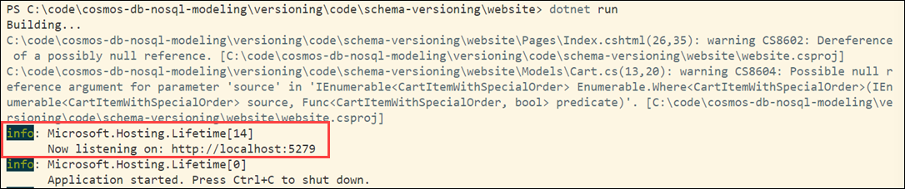

# Schema Versioning Demo

To run this demo for schema versioning, you will need to have:

- [.NET 6.0 Runtime](https://dotnet.microsoft.com/en-us/download/dotnet/6.0)

## Confirm required tools are installed

Confirm you have the required versions of the tools installed for this demo.

First, check the .NET runtime with this command:

```bash
dotnet --list-runtimes
```

As you may have multiple versions of the runtime installed, make sure that .NET components with versions that start with 6.0 appear as part of the output.

## Create an Azure Cosmos DB for NoSQL account

This template will create an Azure Cosmos DB for NoSQL account with a database named `CartsDemo` with a container named `Carts`. The data generator defaults to these values.

The suggested account name includes 'YOUR_SUFFIX'. Change that to a suffix to make your account name unique.

The Azure Cosmos DB for NoSQL account will automatically be created with the region of the selected resource group.

There is an option to enable the free tier. This is so that others can try this out with minimal costs to them.

---

**This link will work if this is a public repo.**

[](https://portal.azure.com/#create/Microsoft.Template/uri/https%3A%2F%2Fraw.githubusercontent.com%2Fsolliancenet%2Fcosmos-db-nosql-modeling%2Fmain%2Fschema-versioning%2Fcode%2Fazuredeploy.json)

**For the private repo**

1. [Create a custom template deployment](https://portal.azure.com/#create/Microsoft.Template/).
2. Select **Build your own template in the editor**.
3. Copy the contents from [this template](azuredeploy.json) into the editor.
4. Select **Save**.

---

Once the template is loaded, populate the values:

- **Subscription** - Choose a subscription.
- **Resource group** - Choose a resource group.
- **Region** - Select a region for the instance.
- **Location** - Enter a location for the Azure Cosmos DB for NoSQL account. **Note**: By default, it is set to use the location of the resource group. If you need to change this value, you can find the supported regions for your subscription via:
  - [Azure CLI](https://learn.microsoft.com/cli/azure/account?view=azure-cli-latest#az-account-list-locations)
  - PowerShell: `Get-AzLocation | Where-Object {$_.Providers -contains "Microsoft.DocumentDB"} | Select location`
- **Account Name** - Replace `YOUR_SUFFIX` with a suffix to make your Azure Cosmos DB account name unique.
- **Database Name** - Set to the default **Sales**.
- **Container Name** - This is the container partitioned by `/id`. Set to the default **Carts**.
- **Throughput** - Set to the default **400**.
- **Enable Free Tier** - This defaults to `false`. Set it to **true** if you want to use it as [the free tier account](https://learn.microsoft.com/azure/cosmos-db/free-tier).

Once those settings are set, select **Review + create**, then **Create**.

## Set up environment variables

You need 2 environment variables to run these demos.

1. Once the template deployment is complete, select **Go to resource group**.
2. Select the new Azure Cosmos DB for NoSQL account.
3. From the navigation, under **Settings**, select **Keys**. The values you need for the environment variables for the demo are here.

Create 2 environment variables to run the demos:

- `COSMOS_ENDPOINT`: set to the `URI` value on the Azure Cosmos DB account Keys blade.
- `COSMOS_KEY`: set to the Read-Write `PRIMARY KEY` for the Azure Cosmos DB for NoSQL account

Create your environment variables with the following syntax:

PowerShell:

```powershell
$env:COSMOS_ENDPOINT="YOUR_COSMOS_ENDPOINT"
$env:COSMOS_KEY="YOUR_COSMOS_READ_WRITE_PRIMARY_KEY"
```

Bash:

```bash
export COSMOS_ENDPOINT="YOUR_COSMOS_ENDPOINT"
export COSMOS_KEY="YOUR_COSMOS_KEY"
```

Windows Command:

```text
set COSMOS_ENDPOINT=YOUR_COSMOS_ENDPOINT
set COSMOS_KEY=YOUR_COSMOS_KEY
```

## Generate data

Run the data generator to generate original carts and schema-versioned carts.

```bash
cd ./data-generator
dotnet run
```

The number of carts that you specify will be doubled. The generator generates the same number of original carts and versioned carts.

The output will look something like this:

```bash
This code will generate sample carts and create them in an Azure Cosmos DB for NoSQL account.
The primary key for this container will be /id.


Enter the database name [default:CartsDemo]:

Enter the container name [default:Carts]:

How many carts should be created?
3
Check Carts for new carts
Press Enter to exit.
```

## Run the website to show generated data

Run the website to display the carts.

```bash
cd ./website
dotnet run
```

Navigate to the URL displayed in the output. In the example below, the URL is shown as part of the `info` output, following the "Now listening on:" text.



The output will show a variety of randomly generated carts and include the schema version when populated. When a cart contains no special items, the Special Order Notes field will not appear in the cart table.


