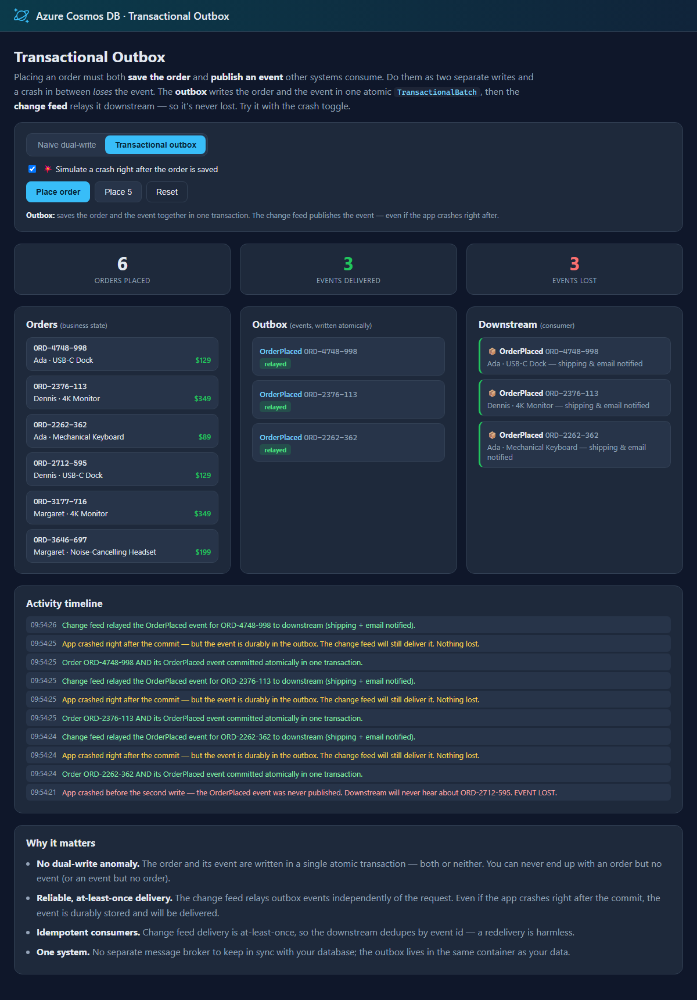

# Azure Cosmos DB design pattern: Transactional Outbox

Many operations must do two things at once: **change business state** and **publish an event** that other systems consume (send a confirmation email, notify shipping, update analytics). The obvious approach — save the state, then publish the event as a second step — is a **dual-write**, and it's unreliable: if the process crashes (or the network blips) *between* the two, you're left inconsistent. Either the state changed but the event was never sent (a lost event), or the event was sent but the state write failed (a phantom event). There is no way to make two independent writes atomic.

The **transactional outbox** fixes this:

1. Write the **state change** and an **event document** into the *same* Cosmos DB container in a single **`TransactionalBatch`** — which is **atomic** within one logical partition. Both are committed, or neither is.
2. A **change feed processor** reads the event documents and relays them to downstream consumers, independently of the original request. Because the event was committed together with the state, it can never be lost — even if the app dies the instant after the commit.

This sample demonstrates:

- ✅ Writing state + event **atomically** with `TransactionalBatch`
- ✅ Relaying events with the **change feed** (reliable, at-least-once delivery)
- ✅ **Idempotent** consumers (dedupe by event id, since delivery is at-least-once)
- ✅ A side-by-side **naive dual-write vs. outbox** comparison — with a crash toggle that *loses* events in the naive version but never in the outbox

## Web front end

Toggle between **naive dual-write** and **transactional outbox**, flip on **"simulate a crash after saving the order"**, and place orders. Watch the counters: with the naive version, crashed orders lose their events; with the outbox, every event is still delivered by the change feed.



## Common scenario

Any workflow that must change data *and* notify other systems reliably:

- **E-commerce** — place an order and emit `OrderPlaced` so shipping, billing, and email react.
- **Banking** — record a transfer and emit `FundsTransferred`.
- **User management** — create an account and emit `UserRegistered` for provisioning and welcome emails.

In each case the outbox guarantees the event is published if and only if the state change is committed.

## Sample implementation

Placing an order writes an **Order** document and an **`OrderPlaced` event** document into the `OrderStore` container. Both share the same `orderId` partition key, so they can be written in one atomic batch (`source/TransactionalOutbox/OrderOutboxService.cs`):

```csharp
var response = await container
    .CreateTransactionalBatch(new PartitionKey(orderId))
    .CreateItem(order)   // business state
    .CreateItem(evt)     // outbox event — committed together, or not at all
    .ExecuteAsync();
```

A change feed processor relays the event documents (identified by a `docType` discriminator) to the downstream consumer. The consumer dedupes by event id, because change feed delivery is at-least-once:

```csharp
// In the change feed handler:
if (doc["docType"]?.ToString() == "event")
{
    downstream.Deliver(doc); // idempotent: dedupe by event id
}
```

The naive mode, by contrast, saves the order and then publishes the event as a *separate* write — so a crash in between loses it. The web app lets you trigger exactly that and watch the difference.

> **Note on the change feed and loops.** The relay only *reads* the outbox events and delivers them to an external consumer; it does not write back to the container, so there's no feedback loop. If you instead marked events as "published" by updating them in place, you'd use the [loop-safe change feed](../loop-safe-change-feed/) technique.

This sample ships two ways to explore the pattern:

- An **interactive web front end** (`source/Website`) — the naive-vs-outbox crash playground described above.
- A **console app** (`source/Console`) that places orders in each mode (with and without a crash) and prints how many events were delivered vs. lost.

## Getting the code

### Using Terminal or VS Code

Directions for installing pre-requisites and cloning this repository are in the [root README](../README.md#getting-started).

## Set up application configuration

Each app reads `CosmosUri` (and optionally `CosmosKey`) from configuration. See [Configuration and authentication](../README.md#configuration-and-authentication) in the root README. When nothing is configured, both apps **default to the local emulator** (`https://localhost:8081`), so they run with zero setup.

## Run the demo locally

Start the local emulator first (see the [root README](../README.md#run-locally-with-the-emulator-default)), or point at your own account:

```bash
docker compose up -d
```

### Interactive web front end (recommended)

```bash
cd source/Website
dotnet run
```

Open the URL it prints. Turn on **Simulate a crash**, place a few orders in **Naive dual-write** mode, and watch the **events lost** counter climb. Switch to **Transactional outbox** and place more — every event is delivered, because it was committed with the order and relayed by the change feed.

### Console app

```bash
cd source/Console
dotnet run
```

The console places orders three ways (naive without a crash, naive with a crash, outbox with a crash) and prints the final tally of events delivered vs. lost.

## (Optional) Deploy and run in Azure with `azd`

The steps above run the sample **all-local**. To run the **all-Azure** way — the web front end hosted in Azure over a keyless Cosmos DB account — this pattern includes an [Azure Developer CLI (`azd`)](https://aka.ms/azd) template. Running locally is unchanged; the deployment files (`azure.yaml`, `infra/`) have no effect unless you run `azd up`.

It provisions and deploys, intentionally minimal and cheap:

- An **App Service** web app (Basic **B1**, **Always On**) that hosts the change feed relay and serves the front end.
- A **serverless** Azure Cosmos DB account with local (key) authentication **disabled**, with the `OutboxDB` database and `OrderStore` + `leases` containers pre-created.
- The web app reaches Cosmos DB **keyless**, via a **user-assigned managed identity** — no keys or connection strings are stored anywhere. The deploying user is also granted data access so you can run the console app locally against the same account.

### Deploy

From the `transactional-outbox` folder:

```bash
azd up
```

### Clean up

```bash
azd down
```

## Summary

The transactional outbox makes "change state and publish an event" reliable by turning two unreliable writes into one atomic transaction plus a durable, replayable relay. `TransactionalBatch` gives you the atomic commit; the change feed gives you at-least-once delivery to idempotent consumers — all within Azure Cosmos DB, with no separate message broker to keep in sync.
