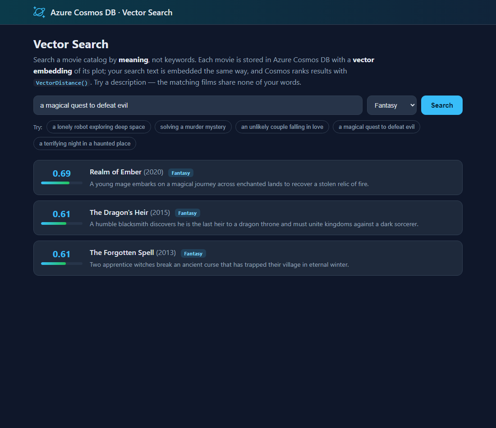

# Azure Cosmos DB design pattern: Vector Search

Traditional queries match **keywords** — they find rows where a column *equals* or *contains* some text. **Vector search** matches **meaning**. Each document is stored alongside a **vector embedding** (an array of numbers that captures the meaning of its text), and searches return the documents whose vectors are *closest* to the query's vector. So a search for *"a lonely robot exploring deep space"* can surface a sci-fi film whose description shares **none** of those words.

Azure Cosmos DB for NoSQL does this **natively** — you don't need a separate search service. You declare a **vector index** on a property and query it with the **`VectorDistance()`** function. This is the storage-and-retrieval foundation of **retrieval-augmented generation (RAG)**: embed your knowledge, retrieve the most relevant pieces by similarity, and feed them to an LLM.

This sample demonstrates:

- ✅ A container created with a **vector embedding policy** and a **DiskANN vector index**
- ✅ **Semantic (similarity) search** with `VectorDistance()` and `ORDER BY VectorDistance(...)`
- ✅ **Filtered vector search** — a normal `WHERE` filter (genre) combined with vector ranking in **one** query
- ✅ Embeddings generated by a **small local model** — no API key, no cloud call, fully offline

## Web front end

Type a description, optionally filter by genre, and see the ranked matches with their similarity scores — the films share none of your words, yet the right ones rise to the top:



## Common scenario

Vector search powers a growing set of scenarios that keyword search handles poorly:

1. **Semantic search** — find products, documents, or media by description or intent, not exact terms.
2. **Retrieval-augmented generation (RAG)** — retrieve the most relevant context for an LLM so it can answer questions grounded in your data.
3. **Recommendations and "more like this"** — find items similar to one a user already likes.
4. **Deduplication / clustering** — group near-identical or related records.

Because Cosmos DB stores the vectors *with* the rest of your data and indexes them, you can combine similarity with ordinary filters, partitioning, and transactions — no second system to keep in sync.

## Sample implementation

The sample indexes a small **movie catalog**. Each movie's title + plot is turned into a **384-dimensional** embedding and stored on the document; a search embeds your query text the same way and ranks movies by cosine similarity.

The embedding step uses [`SmartComponents.LocalEmbeddings`](https://github.com/dotnet/smartcomponents/blob/main/docs/local-embeddings.md) ([NuGet](https://www.nuget.org/packages/SmartComponents.LocalEmbeddings)), a small **local** model ([`bge-micro-v2`](https://huggingface.co/TaylorAI/bge-micro-v2) — 384-dimensional, ~16 MB, bundled in the package and run on the CPU via ONNX). It runs **entirely offline with no API key**, which keeps the sample emulator-first — and it's fast: the [library docs](https://github.com/dotnet/smartcomponents/blob/main/docs/local-embeddings.md) note it computes an embedding in **under a millisecond**, which is why searches feel instant. Embeddings are the **pluggable** part of the pattern: swap the local model for **Azure OpenAI** (or any provider) and everything else stays the same. The only rule is that the *same* model must embed both the stored documents and the query.

The two Cosmos-specific pieces live in `source/VectorSearch/MovieVectorStore.cs`:

**1. Create the container with a vector policy + index** (only possible at creation time):

```csharp
var containerProperties = new ContainerProperties("Movies", "/id")
{
    VectorEmbeddingPolicy = new VectorEmbeddingPolicy(new Collection<Embedding>
    {
        new() { Path = "/embedding", DataType = VectorDataType.Float32,
                DistanceFunction = DistanceFunction.Cosine, Dimensions = 384 }
    }),
    IndexingPolicy = new IndexingPolicy
    {
        VectorIndexes = new Collection<VectorIndexPath>
        {
            new() { Path = "/embedding", Type = VectorIndexType.DiskANN }
        }
    }
};
// Keep the large embedding array out of the normal index; the vector index covers it.
containerProperties.IndexingPolicy.ExcludedPaths.Add(new ExcludedPath { Path = "/embedding/*" });
```

**2. Query by similarity** — `ORDER BY VectorDistance(...)` returns the nearest matches first, and you can add a plain `WHERE` filter:

```sql
SELECT TOP @top c.id, c.title, c.plot, c.genre, c.year,
       VectorDistance(c.embedding, @vector) AS score
FROM c
WHERE c.genre = @genre           -- optional metadata filter, combined with vector ranking
ORDER BY VectorDistance(c.embedding, @vector)
```

This sample ships two ways to explore the pattern:

- An **interactive web front end** (`source/Website`) — type a description, optionally filter by genre, and see the ranked matches with their similarity scores. The best way to *feel* how meaning-based search differs from keywords.
- A **console app** (`source/Console`) that seeds the catalog and runs several semantic queries, printing the ranked results — a quick, scriptable demonstration.

## Getting the code

### Using Terminal or VS Code

Directions for installing pre-requisites and cloning this repository are in the [root README](../README.md#getting-started).

## Set up application configuration

Each app reads `CosmosUri` (and optionally `CosmosKey`) from configuration. See [Configuration and authentication](../README.md#configuration-and-authentication) in the root README. When nothing is configured, both apps **default to the local emulator** (`https://localhost:8081`), so they run with zero setup.

> **Note:** the first run downloads the local embedding model (~16 MB, via NuGet) once; after that it works fully offline.

## Run the demo locally

Start the local emulator first (see the [root README](../README.md#run-locally-with-the-emulator-default)), or point at your own account:

```bash
docker compose up -d
```

### Interactive web front end (recommended)

```bash
cd source/Website
dotnet run
```

Open the URL it prints. After a moment (it loads the embedding model and seeds the catalog), type a description — try *"a terrifying night in a haunted place"* or *"an unlikely couple falling in love"* — and watch films you never named rise to the top. Add a genre filter to see metadata + vector ranking together.

### Console app

```bash
cd source/Console
dotnet run
```

The console seeds the catalog (embedding each movie locally) and runs several semantic queries, printing the top matches and their similarity scores.

## (Optional) Deploy and run in Azure with `azd`

The steps above run the sample **all-local**. To run the **all-Azure** way — the web front end hosted in Azure over a keyless Cosmos DB account — this pattern includes an [Azure Developer CLI (`azd`)](https://aka.ms/azd) template. Running locally is unchanged; the deployment files (`azure.yaml`, `infra/`) have no effect unless you run `azd up`.

It provisions and deploys, intentionally minimal and cheap:

- An **App Service** web app (Basic **B1**, **Always On**) that loads the embedding model, seeds the catalog, and serves the front end.
- A **serverless** Azure Cosmos DB account with local (key) authentication **disabled**, with the `MoviesDB` database and a `Movies` container **pre-created with the vector embedding policy + DiskANN index** (a vector index can only be set when the container is created).
- The web app reaches Cosmos DB **keyless**, via a **user-assigned managed identity** — no keys or connection strings are stored anywhere. The deploying user is also granted data access so you can run the console app locally against the same account.

### Deploy

From the `vector-search` folder:

```bash
azd up
```

### Clean up

```bash
azd down
```

## Testing and CI/CD (a useful side effect of local embeddings)

Because the embedding model runs **locally** and needs **no API key and no deployed model endpoint**, the AI part of this sample can be built and tested in **continuous integration with no secrets**. That's a real simplification: the usual approach — pre-provisioning a hosted model and storing its keys as CI secrets — is replaced by a package restore.

This repository's integration tests demonstrate it. Under `tests/CosmosDesignPatterns.Tests/VectorSearch` you'll find:

- `VectorSearchTests` — uses small, deterministic vectors to assert the Cosmos DB vector mechanics (index creation, `VectorDistance()` ordering, filtered vector search).
- `LocalEmbeddingTests` — runs the **real** local model end to end (embed → store in a vector-indexed container → search by meaning → assert the right result ranks first), plus a pure-model check that "kitten" embeds closer to "cat" than to "financial report".

Both run in GitHub Actions against the Cosmos DB emulator with **no keys configured**. Because embeddings are deterministic, the semantic assertions are stable.

> **Honest caveat:** keyless does not mean network-free. The `SmartComponents.LocalEmbeddings` package fetches the ~16 MB model from Hugging Face at **build time** (then caches it), so CI needs egress to `huggingface.co`. For a fully hermetic/air-gapped build you would vendor the `.onnx` file into your own storage. No secrets or model endpoints are required either way.

## Completing the picture: local generation (a possible future step)

This sample covers the **retrieval** half of retrieval-augmented generation (RAG) — finding the most relevant context by meaning. A natural next step is the **generation** half: feed the retrieved movies to a language model to answer a question in natural language (for example, *"recommend a movie for a cozy night in and say why"*).

We may explore adding an **optional, local** generation step in the future so the whole RAG loop stays keyless. It's feasible today with small local models (for example **Phi-4-mini** or **Llama 3.2 1B/3B**) via [ONNX Runtime GenAI](https://github.com/microsoft/onnxruntime-genai) or [LLamaSharp](https://github.com/SciSharp/LLamaSharp), behind [`Microsoft.Extensions.AI`](https://learn.microsoft.com/dotnet/ai/). Note the trade-offs versus the tiny embedding model, though: generative models are much larger (roughly **0.3–2 GB** quantized) and slower (**seconds** per answer on CPU, not milliseconds), and their output is non-deterministic, which makes them heavier for CI. For that reason any generation step would be **optional** (or delegated to Azure OpenAI in production), keeping the core sample fast and light.

## Summary

Vector search lets Azure Cosmos DB find data by **meaning** instead of keywords, using a native vector index and the `VectorDistance()` function — with similarity, metadata filters, and your operational data all in one place. It's the retrieval foundation for semantic search and RAG. Generate embeddings however you like (a local model here, Azure OpenAI in production); the Cosmos DB indexing and query stay the same.
